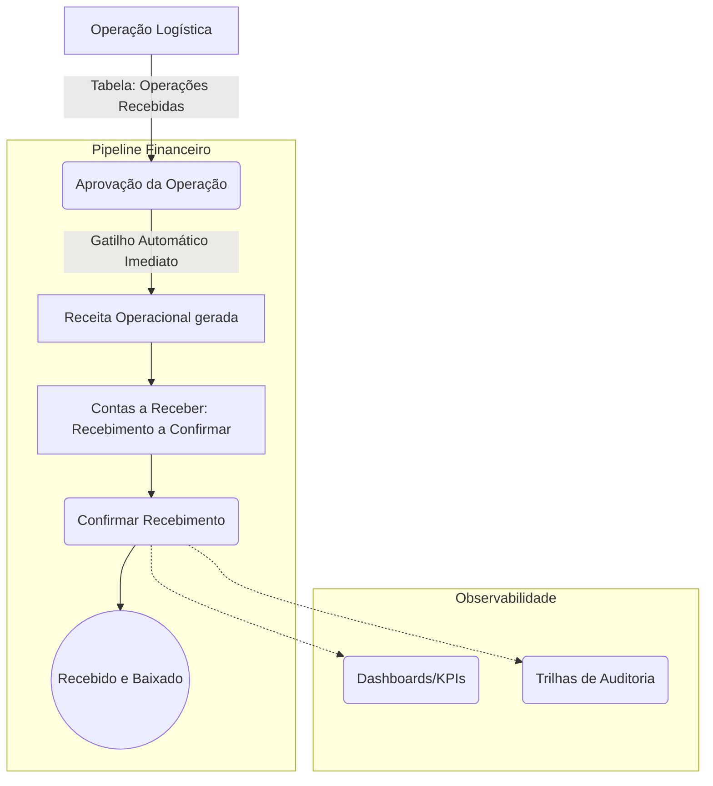
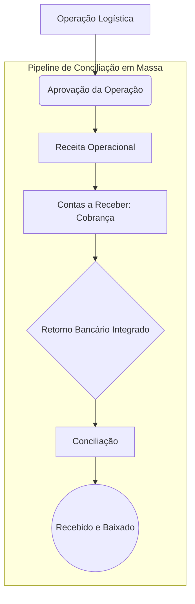

# GUIA ARQUITETURAL OFICIAL DO ORBE (HOMOLOGADO E2E)

Este guia consolida o comportamento verificado durante a validação estrutural (End-to-End) do Pipeline de Receitas Operacionais, servindo como **Fonte da Verdade** para o ORBE.
A arquitetura se pauta em um desacoplamento severo em duas frentes independentes:

---

## O Paradigma da Separação

A arquitetura oficial do ORBE possui duas linhas paralelas exclusivas:

### 1. Pipeline Transacional
Onde a transição de estado da regra de negócio (Logística e Financeiro) opera ativamente.
```text
Operação -> Receita -> Contas a Receber -> Recebimento -> Finalização Financeira
```

### 2. Camada de Observabilidade
Onde componentes passivos apenas "escutam" os registros e eventos inseridos pelo Pipeline Transacional:
* Dashboard Executivo
* KPIs
* Timeline Local
* Timeline Corporativa
* Auditoria

Nenhum fluxograma, UI, ou especificação deve sugerir que instâncias de Governança (Auditoria, KPIs) são "Etapas" do processo financeiro; elas são exclusivamente **monitoramento automático acionado via DB Triggers (Event-driven)**.

---

## 3. Fluxograma Homologado (Visualizações)

### 3.1. Caixa Imediato (Pix, Dinheiro, Débito)
O fluxo de Caixa Imediato não utiliza a tela de `Conciliação Bancária` avulsa. O Ciclo Encerra (baixa financeira confirmada) na própria tela de Contas a Receber.



### 3.2. Fluxos Massivos (Boletos, Duplicatas, Faturamento Mensal)
Nesta arquitetura, a conta demanda o ciclo de Conciliação Bancária devido à necessidade de integração em massa de arquivos **CNAB/Remessas**, distanciando-se de transações atomizadas.



---

## 4. Semântica Definitiva de Desacoplamento (Lógica Modular)
Foi validado formalmente e em produção que a Operação Original se **desprende puramente visualmente** da jornada financeira imediatamente após o passo de Aprovação.

* **Status da Operação Logística:** Mantém-se estática após encaminhamento (ex: `Aguardando Faturamento`). Ele guarda o fato de que "O serviço foi prestado e o setor operacional encerrou o manuseio despachando o romaneio para o financeiro".
* **Status do Módulo Financeiro:** Representa fielmente a transição de saldo (ex: `Pendente Cobrança`, `Recebido`).

Este elo é costurado apenas pelo ID (`operacao_id` referenciado na `receita_operacional`), garantindo um motor hermético, prevenindo bugs entre módulos. Todo este comportamento está **homologado sem refatoração remanescente**.