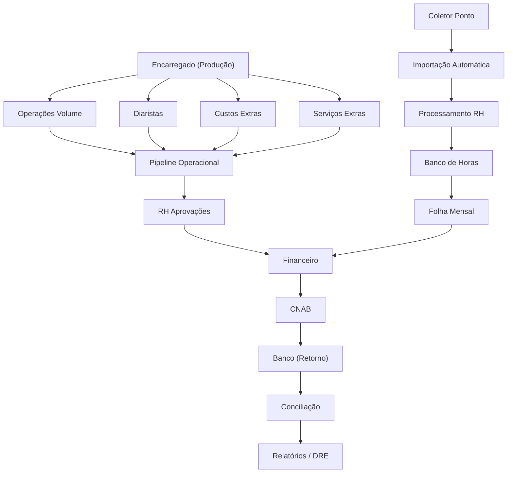

# 📋 RELATÓRIO DE AUDITORIA — ERP ORBE

> **Data:** 01/06/2026  
> **Escopo:** Auditoria completa conforme `fixvideos.md`  
> **Status Geral:** ⚠️ Parcial — projeto funcional com pontos de melhoria identificados

---

## 1. CONTEXTO DO NEGÓCIO

O Orbe é um ERP de **operações logísticas** que controla todo o ciclo de vida operacional:

```
CAPTURA → PROCESSAMENTO → RH → FINANCEIRO → BANCÁRIO/CNAB → CONCILIAÇÃO → RELATÓRIOS → AUDITORIA
```

Os pilares do sistema estão organizados em:

| Pilar | Função |
|---|---|
| **Entradas/Captura** | Pontos CLT, Operações por Volume, Diaristas, Serviços Extras, Custos Extras |
| **Processamento/Pipeline** | Pipeline Operacional, Processamento RH, Banco de Horas |
| **RH** | Aprovações, Painel Diaristas, Gestão Cadastral |
| **Financeiro** | Central Financeira, Faturamento, CNAB, Retorno Bancário |
| **Governança** | Usuários, Perfis, Auditoria, Automação |

---

## 2. ESTRUTURA ATUAL DO PROJETO

### 2.1 Mapa de Pastas

```
src/
├── App.tsx                    # 236 linhas — roteamento principal (50+ rotas)
├── api/                       # 3 arquivos — camada API
├── components/                # 94 arquivos — componentes UI + operacionais
│   ├── Auth/                  # 3 — guards de autenticação
│   ├── layout/                # 9 — sidebar, navbar, modal operacional
│   ├── modals/                # 2 — modais reutilizáveis
│   ├── onboarding/            # 4 — fluxo de onboarding
│   ├── operacoes/             # 5 — tabelas e blocos operacionais
│   ├── painel/                # 5 — painéis dashboard
│   ├── ponto/                 # 4 — componentes de ponto
│   ├── regras/                # 3 — regras operacionais
│   ├── shared/                # 2 — componentes compartilhados
│   └── ui/                    # 52 — design system (shadcn/ui)
├── constants/                 # 1 arquivo
├── contexts/                  # 8 providers React
├── data/                      # 1 arquivo
├── hooks/                     # 8 hooks customizados
├── lib/                       # 4 arquivos — supabase client, utils
├── pages/                     # 73 arquivos em 9 subpastas
│   ├── Auth/                  # 6 — login, cadastro, senha
│   ├── BancoHoras/            # 4 — painel, regras, extrato, processamento
│   ├── Cliente/               # 3 — portal do cliente
│   ├── Configuracoes/         # 1
│   ├── Financeiro/            # 12 — central, CNAB, retorno, contas
│   ├── Governanca/            # 4 — usuários, perfis, auditoria, automação
│   ├── Producao/              # 3 — diaristas, custos extras, serviços extras
│   ├── Relatorios/            # 7 — hub, detalhe, agendamentos, layouts
│   └── Rh/                    # 4 — aprovações, diaristas painel/gestão
├── services/                  # 38 arquivos
│   ├── base.service.ts        # 5052 linhas — 30+ service classes
│   ├── rhProcessing.service.ts # 1660 linhas — motor RH
│   ├── rhFinanceiro.service.ts # 1142 linhas — handoff RH→Financeiro
│   ├── v4.service.ts          # 1112 linhas — banco de horas
│   ├── dashboard.service.ts   # 751 linhas — KPIs consolidados
│   ├── financial.service.ts   # contas a pagar/receber
│   ├── cnab/                  # 17 arquivos — gerador CNAB 240
│   ├── operationalEngine/     # 6 arquivos — motor operacional
│   └── automation/            # 2 arquivos
├── test/                      # 5 arquivos de teste
├── types/                     # 3 arquivos de tipos
└── utils/                     # 4 utilitários

supabase/
├── config.toml
├── functions/                 # 7 edge functions
│   ├── create-tenant/
│   ├── delete-demo-data/
│   ├── generate-demo-data/
│   ├── importar-pontos-google-drive/
│   ├── importar-pontos-manual/
│   ├── process-day/
│   └── resolve-drive-folder/
├── migrations/                # 169 migrations
├── schema.sql
└── seed.sql
```

### 2.2 Mapa de Rotas

| Rota | Componente | Pilar |
|---|---|---|
| `/operacional/dashboard` | Dashboard | Operacional |
| `/operacional/pontos` | Pontos | Operacional |
| `/operacional/operacoes` | Operacoes | Operacional |
| `/operacional/diaristas` | RhDiaristasPainel | Operacional |
| `/operacional/pipeline` | PipelineOperacional | Operacional |
| `/producao` | LancamentoProducao | Captura (Encarregado) |
| `/producao/diaristas` | DiaristasLancamento | Captura (Encarregado) |
| `/producao/custos-extras` | CustosExtrasLancamento | Captura (Encarregado) |
| `/producao/servicos-extras` | ServicosExtrasLancamento | Captura (Encarregado) |
| `/rh/aprovacoes` | AprovacoesRh | RH |
| `/rh/diaristas` | AprovacoesRh | RH |
| `/rh/diaristas/cadastros` | RhDiaristasGestao | RH |
| `/financeiro` | CentralFinanceira | Financeiro |
| `/bancario` | CentralBancaria | Bancário |
| `/financeiro/remessa` | RemessaCNAB | Bancário |
| `/financeiro/retorno` | RetornoBancario | Bancário |
| `/financeiro/contas-bancarias` | ContasBancarias | Bancário |
| `/financeiro/faturamento` | FaturamentoCliente | Financeiro |
| `/financeiro/regras` | RegrasCalculo | Financeiro |
| `/cadastros` | CentralCadastros | Cadastros |
| `/cadastros/regras-operacionais` | RegrasOperacionais | Cadastros |
| `/colaboradores` | Colaboradores | Cadastros |
| `/empresas` | Empresas | Cadastros |
| `/transportadoras` | Transportadoras | Cadastros |
| `/fornecedores` | Fornecedores | Cadastros |
| `/servicos` | Servicos | Cadastros |
| `/coletores` | Coletores | Cadastros |
| `/banco-horas` | PainelGeralBH | RH/BH |
| `/banco-horas/regras` | RegrasBH | RH/BH |
| `/banco-horas/extrato/:id` | ExtratoColaborador | RH/BH |
| `/banco-horas/processamento` | ProcessamentoRH | RH/BH |
| `/relatorios` | CentralRelatoriosIntegracoes | Relatórios |
| `/governanca` | CentralGovernanca | Governança |
| `/governanca/usuarios` | UsuariosGestao | Governança |
| `/governanca/perfis` | PerfisPermissoes | Governança |
| `/governanca/auditoria` | AuditoriaLogs | Governança |
| `/governanca/automacao` | AutomacaoOperacional | Governança |
| `/cliente/*` | ClientDashboard/Reports/Approvals | Portal do Cliente |

### 2.3 Services Principais

| Service | Tabela Supabase | Responsabilidade |
|---|---|---|
| `EmpresaService` | `empresas` | CRUD + contagens + tenant_id |
| `ColaboradorService` | `colaboradores` | CRUD + dados bancários + filtros operacionais |
| `OperacaoService` | `operacoes` | Painel operacional + merge produção/legado |
| `PontoService` | `registros_ponto` | CRUD + filtro por mês/empresa + import |
| `ColetorService` | `coletores` | CRUD + resolução Google Drive |
| `UnidadeService` | `unidades` | Unidades por empresa |
| `RegraCalculoService` | `financeiro_regras` | Regras de cálculo financeiro |
| `RegrasFinanceirasService` | `regras_financeiras` | Modalidades + formas de pagamento |
| `CompetenciaService` | `financeiro_competencias` | Competências mensais |
| `ConsolidadoService` | — | Consolidado por competência + aprovação |
| `ResultadosService` | `resultados_processamento` | Resultados processamento RH |
| `HistoricoImportacaoService` | `historico_importacoes` | Logs de importação |
| `LogSincronizacaoService` | `logs_sincronizacao` | Logs de sincronização |
| `BHRegraService` | `banco_horas_regras` | Regras banco de horas |
| `BHEventoService` | `banco_horas_eventos` | Eventos BH + saldos + extrato |
| `DashboardConsolidadoService` | — | KPIs por competência |
| `RHFinanceiroService` | — | Validação/aprovação competência → lotes |
| `CicloOperacionalService` | — | Motor de ciclo operacional |
| `MotorFinanceiro` | — | Motor financeiro |

### 2.4 Contexts

| Context | Responsabilidade |
|---|---|
| `AuthContext` | Autenticação Supabase |
| `TenantContext` | Isolamento multi-tenant |
| `AccessControlContext` | Perfis e permissões |
| `OnboardingContext` | Status de onboarding |
| `OperationalPipelineContext` | Estado do pipeline operacional (43KB) |
| `ClientContext` | Portal do cliente |
| `PreferencesContext` | Preferências do usuário |
| `SelectionContext` | Seleção global |

### 2.5 Hooks

| Hook | Responsabilidade |
|---|---|
| `useOperationalPulse` | Dados em tempo real do pipeline operacional (22KB) |
| `useTenantFilter` | Filtro por tenant |
| `useAdminOverride` | Override administrativo |
| `useOnboardingCallback` | Callback de onboarding |
| `useOnboardingValidation` | Validação de onboarding |
| `useOperationalPipelineAutoTrigger` | Auto-trigger do pipeline |
| `use-mobile` | Detecção mobile |
| `use-toast` | Sistema de toast |

### 2.6 Edge Functions Supabase

| Função | Descrição |
|---|---|
| `create-tenant` | Criação de tenant |
| `delete-demo-data` | Limpeza de dados demo |
| `generate-demo-data` | Geração de dados demo |
| `importar-pontos-google-drive` | Importação de pontos via Google Drive |
| `importar-pontos-manual` | Importação manual de pontos |
| `process-day` | Processamento diário automático |
| `resolve-drive-folder` | Resolução de pasta do Drive |

### 2.7 Testes Existentes

| Arquivo | Escopo |
|---|---|
| `ciclo-operacional-validar-financeiro.spec.ts` | Validação financeira do ciclo |
| `fluxo-ponto-importacao.spec.ts` | Fluxo de importação de pontos |
| `fluxo-rh-financeiro-cnab.spec.ts` | Fluxo RH → Financeiro → CNAB |
| `example.test.ts` | Teste de exemplo |

---

## 3. PAPÉIS DE USUÁRIOS E ACESSOS

### 3.1 Admin

- Cadastrar usuários, empresas, colaboradores, transportadoras, fornecedores, serviços
- Definir permissões e perfis
- Configurar regras operacionais e financeiras
- Acesso total ao sistema

### 3.2 Encarregado

- Portal de produção: `/producao`, `/producao/diaristas`, `/producao/custos-extras`, `/producao/servicos-extras`
- Login operacional separado: `/login/operacional`
- Lançar operações por volume, diaristas, custos extras, serviços extras
- **NÃO** deve acessar áreas admin, financeiro ou governança

### 3.3 RH

- Aprovações RH: `/rh/aprovacoes`
- Painel Diaristas: `/operacional/diaristas`
- Banco de Horas: `/banco-horas/*`
- Validação de ciclos e competências

### 3.4 Financeiro

- Central Financeira: `/financeiro`
- Central Bancária: `/bancario`
- CNAB, Retorno, Faturamento
- Aprovação de pagamentos

---

## 4. MOTORES OPERACIONAIS — STATUS DE IMPLEMENTAÇÃO

### 4.1 Operações por Volume

| Item | Status | Observação |
|---|---|---|
| Lançamento pelo encarregado | ✅ Implementado | `LancamentoProducao.tsx` (143KB) |
| Seleção empresa/transportadora/fornecedor | ✅ Implementado | Formulário completo |
| Seleção de colaboradores | ⚠️ Parcial | Bug histórico de persistência (conv. `5f6462c4`) |
| Cálculo valor (volume × unitário) | ✅ Implementado | |
| Forma de pagamento | ⚠️ Parcial | Mapeamento `data_vencimento`/`forma_pagamento` com bugs anteriores |
| ISS / impostos | ⚠️ A validar | Verificar se cálculo está ativo |
| Exibição no ERP principal | ⚠️ Parcial | Inconsistências de dados entre portais |

### 4.2 Diaristas

| Item | Status | Observação |
|---|---|---|
| Lançamento presença | ✅ Implementado | `DiaristasLancamento.tsx` (70KB) |
| Ciclo semanal | ✅ Implementado | `CicloOperacionalService` |
| Fechamento de período | ✅ Implementado | |
| Validação RH | ✅ Implementado | `AprovacoesRh.tsx` |
| Painel RH Diaristas | ⚠️ Parcial | Problemas de visibilidade (múltiplas conversas de fix) |
| Aprovação financeira | ✅ Implementado | `RHFinanceiroService` |
| CNAB | ✅ Implementado | `CentralBancariaDiaristas.tsx` (73KB) |
| Retorno bancário | ✅ Implementado | `RetornoBancario.tsx` |
| Conciliação | ✅ Implementado | |

### 4.3 Pontos CLT / Banco de Horas

| Item | Status | Observação |
|---|---|---|
| Importação automática (coletor) | ✅ Implementado | Edge function `importar-pontos-google-drive` |
| Importação manual | ✅ Implementado | Edge function `importar-pontos-manual` |
| Processamento RH | ✅ Implementado | `rhProcessing.service.ts` (1660 linhas) |
| Banco de horas | ✅ Implementado | `v4.service.ts` — `BHEventoService` |
| Extrato por colaborador | ✅ Implementado | `ExtratoColaborador.tsx` |
| Saldos gerais | ✅ Implementado | |
| Regras BH | ✅ Implementado | `BHRegraService` |
| Folha mensal | ⚠️ Parcial | `buildFolhaBaseItems` + `buildFolhaVariavelItems` existem, verificar completude |

### 4.4 Custos Extras

| Item | Status | Observação |
|---|---|---|
| Lançamento | ✅ Implementado | `CustosExtrasLancamento.tsx` (37KB) |
| Exibição no ERP | ⚠️ A validar | Verificar propagação para financeiro |
| Impacto no DRE | ⚠️ A validar | |

### 4.5 Serviços Extras

| Item | Status | Observação |
|---|---|---|
| Lançamento | ✅ Implementado | `ServicosExtrasLancamento.tsx` (38KB) |
| Exibição no ERP | ⚠️ A validar | Bug anterior de 400 (conv. `095cfeda`) |
| Faturabilidade | ⚠️ A validar | |

### 4.6 Serviços Específicos

| Item | Status | Observação |
|---|---|---|
| Tabela de serviços (CN5C, CN4C, N1, N2) | ❓ Não confirmado | Verificar se `RegrasOperacionais.tsx` (126KB) já implementa |
| Código / descrição / período | ❓ A investigar | |
| Cálculo por período + colaboradores | ❓ A investigar | |

---

## 5. PONTOS CRÍTICOS IDENTIFICADOS

### 5.1 Arquivo Monolítico `base.service.ts`

- **5052 linhas** com **30+ classes de serviço**
- Alto acoplamento e risco de regressão
- Difícil manutenção e testes unitários
- **Classificação:** Refatoração média-crítica (longo prazo)

### 5.2 `OperationalPipelineContext.tsx` — 43KB

- Context gigante com estado complexo
- Risco de re-renders desnecessários
- **Classificação:** Refatoração média

### 5.3 `LancamentoProducao.tsx` — 143KB

- Componente de formulário extremamente grande
- Lógica de negócio misturada com UI
- **Classificação:** Refatoração crítica (longo prazo)

### 5.4 `CentralCadastros.tsx` — 275KB

- Maior arquivo do projeto
- Múltiplos módulos de cadastro num só componente
- **Classificação:** Refatoração crítica (longo prazo)

### 5.5 `RhDiaristasPainel.tsx` — 162KB

- Componente muito grande com lógica RH complexa
- Histórico de bugs de visibilidade de dados
- **Classificação:** Refatoração média

### 5.6 Inconsistências de Dados Encarregado → ERP Principal

- Problemas documentados em múltiplas conversas:
  - Colaboradores não persistidos (conv. `5f6462c4`)
  - `data_vencimento`/`forma_pagamento` descartados (conv. `fabac3a5`)
  - Diaristas não visíveis no RH (conv. `c8c3f719`, `1e03e152`, `ea850112`)
  - Serviços extras com erro 400 (conv. `095cfeda`)
  - Pontos `rhid_api` invisíveis (conv. `719786b6`, `7fec2681`)
- **Classificação:** Correção crítica

### 5.7 Dados Mock no Pipeline

- `Math.random()` em `PipelineOperacional.tsx` (conv. `28e86176`)
- Substituição por dados reais parcialmente feita
- **Classificação:** Correção regular-média

### 5.8 Cobertura de Testes

- Apenas **4 specs** de teste para um sistema de ~20.000+ linhas de service
- Sem testes unitários para services individuais
- Sem testes de integração E2E
- **Classificação:** Risco crítico

---

## 6. CLASSIFICAÇÃO DE REFATORAÇÃO

### ✅ Sem Refatoração (funcional e seguro)

- `AuthContext.tsx` — autenticação Supabase simples
- `TenantContext.tsx` — isolamento por tenant
- `PreferencesContext.tsx` — preferências básicas
- Components UI (`src/components/ui/`) — shadcn/ui padronizado
- Edge functions — funções isoladas e testáveis

### 🟡 Refatoração Leve

- `SelectionContext.tsx` — pode ser consolidado
- Hooks `use-mobile.tsx`, `use-toast.ts` — pequenos ajustes
- Pages de autenticação (`Auth/`) — código limpo

### 🟠 Refatoração Média

- `OperationalPipelineContext.tsx` (43KB) — dividir em sub-contexts
- `RhDiaristasPainel.tsx` (162KB) — extrair sub-componentes
- `useOperationalPulse.ts` (22KB) — dividir por domínio
- `dashboard.service.ts` — queries complexas, `safeData` wrapper robusto

### 🔴 Refatoração Crítica

- `base.service.ts` (5052 linhas) — dividir em services por domínio
- `LancamentoProducao.tsx` (143KB) — separar UI de lógica
- `CentralCadastros.tsx` (275KB) — componentizar por módulo
- `RegrasOperacionais.tsx` (126KB) — extrair sub-componentes

---

## 7. PIPELINE OPERACIONAL — ANÁLISE

### Situação Atual

O `PipelineOperacional.tsx` (52KB) funciona como torre de controle com:

- Abas por tipo de entrada
- KPIs consolidados
- Visualizações: Geral, Por Empresa, Por Competência, Pendências Críticas
- Dados alimentados por `useOperationalPulse.ts`

### Pontos de Atenção

1. **Dados mock residuais** — verificar se `Math.random()` foi totalmente removido
2. **Erros 400** — queries resilientes implementadas via `safeData()` no `dashboard.service.ts`
3. **Sincronização** — `staleTime: 5min` e `refetchOnWindowFocus: false` podem causar dados desatualizados

---

## 8. FATURAMENTO, PAGAMENTO E RESULTADO

### Receita / Faturamento

| Componente | Implementação |
|---|---|
| `FaturamentoCliente.tsx` | ✅ Tela existe |
| `DetalhamentoCliente.tsx` | ✅ Tela existe |
| `RegrasCalculo.tsx` | ✅ Tela existe |
| DRE Operacional | ⚠️ A validar completude |

### Despesas / Pagamentos

| Componente | Implementação |
|---|---|
| `CentralFinanceira.tsx` | ✅ 78KB — completa |
| `CentralBancaria.tsx` | ✅ 50KB — completa |
| `CentralBancariaDiaristas.tsx` | ✅ 73KB — completa |
| `RemessaCNAB.tsx` | ✅ Implementada |
| `RetornoBancario.tsx` | ✅ 39KB — conpleta |
| `ContasBancarias.tsx` | ✅ 52KB — completa |

### Motor CNAB

- 17 arquivos no diretório `services/cnab/`
- Geração CNAB 240 BB implementada
- Validação de beneficiários
- Download de arquivos
- Histórico de remessas

---

## 9. CADASTRO DE COLABORADORES

### Campos Validados

O `ColaboradorServiceClass` no `base.service.ts` implementa:

- ✅ Tipo de colaborador
- ✅ Modelo de cálculo (`inferModeloCalculo`)
- ✅ Regime de trabalho (`inferRegimeTrabalho`)
- ✅ Salário base
- ✅ Dados bancários (banco, agência, conta, tipo)
- ✅ Gera faturamento (flag)
- ✅ CPF (com validação de duplicidade)
- ✅ Empresa vinculada

### Campos a Investigar

- ❓ Participa de produção operacional
- ❓ Peso operacional / rateio
- ❓ Valor por diária / por hora / por operação
- ❓ Regra individual de pagamento

---

## 10. SEGURANÇA E TENANT

### Multi-Tenant

- ✅ `TenantContext` com provider global
- ✅ `getCurrentTenantId()` em `base.service.ts`
- ✅ `getTenantQueryFilter()` para queries
- ✅ RLS no Supabase (via session)
- ⚠️ Verificar se todas as queries passam por RLS corretamente

### Autenticação

- ✅ `AuthGuard` para rotas protegidas
- ✅ `PortalGuard` para portal do cliente
- ✅ Login operacional separado para encarregado
- ✅ Fluxo de convite (`/app/convite`)
- ✅ Recuperação de senha

---

## 11. CHECKLIST GLOBAL (ETAPA 9 — fixvideos.md)

### Sanitização

- [ ] Verificar se ainda existem dados mockados em produção
- [ ] Verificar `Math.random()` residual no pipeline
- [ ] Verificar hardcoded values nos services

### Estados Base

- [ ] Toda tela possui estados: loading, empty, error, success
- [ ] Nenhum acesso a `undefined` sem proteção
- [ ] Fallbacks visuais em todos os componentes

### Blindagem de Renderização

- [ ] Error boundaries implementados
- [ ] Proteção contra null em tabelas
- [ ] Fallbacks para dados faltantes

### Formulários

- [ ] Submit não falha silenciosamente
- [ ] Disable durante envio
- [ ] Feedback visual de sucesso/erro
- [ ] Validação consistente

### Modais

- [ ] Abrem/fecham corretamente
- [ ] z-index correto
- [ ] Escape funcional
- [ ] Não travam a interface

### Integrações (API/Supabase)

- [ ] Retry implementado
- [ ] Timeout controlado
- [ ] Fallback em caso de falha
- [ ] Loading states durante requisições

### Hardening

- [ ] Proteção contra null/undefined
- [ ] Proteção contra falha de rede
- [ ] Proteção contra duplicação de requisição
- [ ] Proteção contra race conditions

---

## 12. PRÓXIMOS PASSOS RECOMENDADOS

### Prioridade 1 — Correções Críticas

1. **Auditar inconsistências de dados Encarregado → ERP** (conforme skill `incons-dados-telas`)
2. **Remover dados mock residuais** do Pipeline Operacional
3. **Validar persistência de colaboradores** em operações por volume

### Prioridade 2 — Estabilização

4. **Implementar error boundaries** globais
5. **Adicionar testes** para services críticos
6. **Auditar RLS** em todas as tabelas

### Prioridade 3 — Refatoração Estrutural

7. **Dividir `base.service.ts`** em services por domínio
8. **Componentizar pages grandes** (>100KB)
9. **Dividir `OperationalPipelineContext`** em sub-contexts

### Prioridade 4 — Features Pendentes

10. **Serviços Específicos** (CN5C, CN4C, N1, N2) — confirmar implementação
11. **DRE Operacional** — validar completude
12. **Automação completa** do ciclo Ponto → BH → Folha

---

## 13. DEPENDÊNCIAS CRÍTICAS



---

## 14. RISCOS DE REGRESSÃO

| Risco | Impacto | Mitigação |
|---|---|---|
| Alterar `base.service.ts` | Alto — afeta todos os módulos | Testes antes de qualquer mudança |
| Alterar `OperationalPipelineContext` | Alto — afeta pipeline inteiro | Mudanças incrementais |
| Alterar `LancamentoProducao` | Alto — formulário do encarregado | Testar todos os tipos de input |
| Alterar queries Supabase | Médio — pode quebrar RLS | Validar tenant isolation |
| Alterar CNAB | Crítico — impacta pagamentos | Testes com dados reais |

---

> **Conclusão:** O ERP Orbe possui uma base sólida com todos os pilares implementados. Os principais riscos estão na **concentração de código em arquivos monolíticos**, nas **inconsistências de dados entre portais** e na **baixa cobertura de testes**. A prioridade deve ser estabilizar os fluxos existentes antes de novas features.
