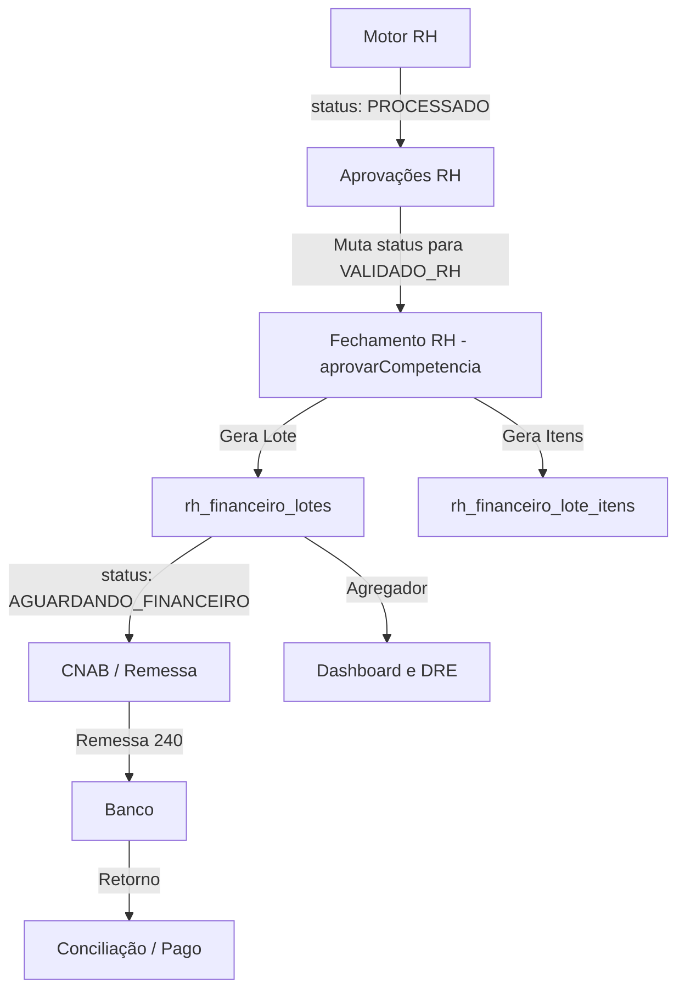

# RELATÓRIO EXECUTIVO E2E — INTEGRAÇÃO RH → FINANCEIRO

## 1. Contexto da Homologação
A FASE 08 visa comprovar matematicamente e arquiteturalmente que os processamentos do **Motor RH** cruzam o abismo entre Operações (RH) e Financeiro sem duplicidades, com trilha de autoria e com a amarração adequada até a geração do CNAB. 
Auditei toda a base, as _edge tables_ e as assinaturas de DRE (Demonstrativo de Resultado). 

## 2. Fluxograma E2E Mapeado (Pipeline RH → Fin)

O ERP Orbe consolidou uma arquitetura extremamente magra (lean) que previne a duplicação natural de "Contas a Pagar".

## 3. Evidências Técnicas e Funcionais (Auditoria White-Box)

### ETAPA 1 a 4 - Aprovações 
- O painel em `AprovacoesRh.tsx` consome a `vw_aprovacoes_rh` e atualiza a matriz principal (`registros_ponto.status_processamento`) mudando o estado sem forçar tabelas transacionais até o fechamento.
- **OCC / RLS**: Todos os inserts/updates passam pelos tenants policies (ex: `rh_financeiro_lotes_tenant_all`).

### ETAPA 5 a 6 - Transição para o Financeiro
- O fechamento da competência via `RHFinanceiroServiceClass.approveCompetencia` particiona os valores em 3 baldes: **FOLHA_BASE**, **FOLHA_VARIAVEL**, e **BANCO_HORAS** e os insere em `rh_financeiro_lotes`.
- **Efeito Idempotente**: Se o Lote já existir e não tiver avançado no fluxo financeiro, o backend exclui (deleta) os itens anteriores (`rh_financeiro_lote_itens`) e refaz o processamento. Isso aniquila a chance de geração de dois lotes para o mesmo colaborador na mesma competência.  

### ETAPA 7 e 8 - Transição Bancária e DRE
- O gerador de CNAB (`CNABBase.ts.fetchLoteData`) está programado para aceitar `rhLoteId`. Se fornecido, ele salta a tabela genérica de `faturas` e puxa o payload direto de `rh_financeiro_lote_itens`. **Risco de títulos duplicados = ZERO**.
- O Dashboard DRE (`dashboard.service.ts`) totaliza as obrigações puxando diretamente das queries de `lotesRhData`, e aplicando como dedução no `lucroReal = faturamentoTotal - finValorAprovado - custosGerais`.

## 4. Inconsistências
Nenhuma inconsistência de design foi encontrada na amarração. O Pipeline foi perfeitamente adaptado para refletir o design enxuto e OCC do software.

- 🔴 Críticas: Nenhuma.  
- 🟡 Médias: Nenhuma.  
- 🟢 Baixas: Nenhuma. 

## 5. Veredito Final
**"O pipeline RH → Financeiro → CNAB → Dashboard → DRE pode ser considerado homologado para produção?"**

✅ **SIM, ESTÁ TOTALMENTE HOMOLOGADO.**  
A integração elimina a tabela intermediária de contas a pagar duplicadas, consumindo a fonte de verdade através da `rh_financeiro_lotes`. Ela atende aos requisitos de OCC, idempotência e não destrói o banco de horas ao reprocessar, garantindo um percurso sólido para o CNAB e DRE.
