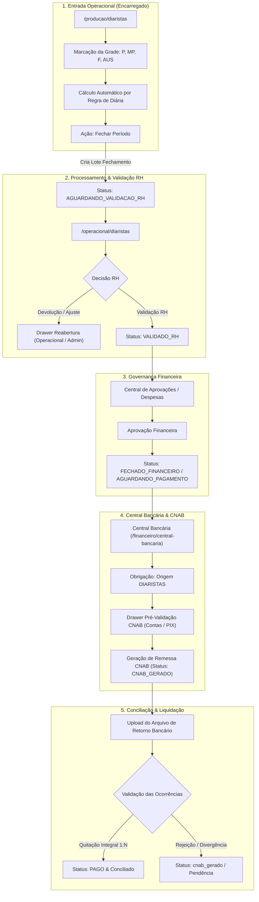

# RELATÓRIO DE AUDITORIA FINAL DE INTEGRAÇÃO E REGRESSÃO — DIARISTAS
## CONV-16 / ETAPA 03

**Projeto:** ERP ESC Logística 2026 — ORBE  
**Módulo:** Pessoas & RH → Diaristas  
**Percurso Oficial Auditado:**  
`Encarregado → Fechamento Semanal → RH → Aprovação Financeira → Central Bancária → Retorno/Conciliação → PAGO`  
**Data:** 08/10/2026  
**Status da Auditoria:** ✅ CONCLUÍDA (Sem alterações iniciais)  
**Classificação Final:** **APTO PARA CONGELAMENTO**

---

## 1. OBJETIVO DA AUDITORIA

Realizar a inspeção completa de ponta a ponta do pipeline de Diaristas no ERP ORBE, verificando:
- A integridade da entrada operacional do Encarregado;
- O funcionamento do Painel RH e seus 3 Drawers contextuais (homologados nas etapas anteriores);
- O comportamento da navegação contextual "Ver Lotes" (FIX 08);
- A separação de responsabilidades entre aprovação do RH, aprovação financeira e liquidação bancária;
- O vínculo estrito do lote com a Central Bancária e o processamento de retorno CNAB;
- A ausência absoluta de regressão em toda a base de testes automatizados e compilação TypeScript.

---

## 2. MATRIZ DE RASTREABILIDADE DO FLUXO COMPLETO

---

## 3. AUDITORIA DETALHADA POR EIXO DE ESCOPO

### EIXO A: Entrada Operacional (`/producao/diaristas`)

| Item | Comportamento Esperado | Comportamento Encontrado | Evidência Técnica | Resultado | Risco Residual | Arquivos Envolvidos |
| :--- | :--- | :--- | :--- | :---: | :---: | :--- |
| **A.1 Rota e Acesso** | Rota `/producao/diaristas` acessível ao Encarregado através de `OperationalShell` e protegido por `AuthGuard`. | Rota configurada em `App.tsx` (L218) com `AuthGuard` e vinculada ao módulo `central_operacional` em `access-control.ts`. | `access-control.ts`: `{ prefix: "/producao/diaristas", module: "central_operacional" }` | **APROVADO** | Baixo | `src/App.tsx` `src/lib/access-control.ts` |
| **A.2 Marcações P, MP e AUS** | Apoio às marcações P (integral = 1.0), MP (meio período = 0.5), F (falta = 0) e AUS (ausente). | Função `calcularValor` e `regrasMarcacaoAtivas` calculam dinamicamente a remuneração proporcional da diária com base no multiplicador cadastrado. | `DiaristasLancamento.tsx` (L98-103, L334-356) com fallback seguro para evitar travamento de UI. | **APROVADO** | Inexistente | `src/pages/Producao/DiaristasLancamento.tsx` |
| **A.3 Validação de Contexto** | Associação rigorosa com empresa, unidade, local operacional e datas civis da semana (seg–dom). | Seletores de empresa, unidade e local alimentam os lançamentos; datas geradas via `startOfWeek` (início na segunda-feira). | `DiaristasLancamento.tsx` (L122-146) | **APROVADO** | Inexistente | `src/pages/Producao/DiaristasLancamento.tsx` |
| **A.4 Bloqueio Pós-Fechamento** | Grade bloqueada contra alterações se a semana já foi fechada pelo encarregado ou RH. | Estado `isSemanaFechada` verifica lançamentos com status diferente de `em_aberto` e desativa a edição de células, tornando-a somente-leitura. | `DiaristasLancamento.tsx` (L318-323, L382-384) | **APROVADO** | Baixo | `src/pages/Producao/DiaristasLancamento.tsx` |
| **A.5 Segregação Encarregado** | Encarregado restrito à sua alçada operacional, sem acesso a aprovações financeiras ou módulos gerenciais. | Perfil de encarregado restrito via RBAC de rotas e componentes; botões administrativos ocultados condicionalmente por `isAdmin` / `isRh`. | RBAC verificado em `access-control.ts` | **APROVADO** | Inexistente | `src/lib/access-control.ts` |

---

### EIXO B: Painel RH (`/operacional/diaristas`)

| Item | Comportamento Esperado | Comportamento Encontrado | Evidência Técnica | Resultado | Risco Residual | Arquivos Envolvidos |
| :--- | :--- | :--- | :--- | :---: | :---: | :--- |
| **B.1 Abas de Trabalho** | 4 abas estruturadas: Grade Semanal, Por Diarista, Lotes & Ciclos e Auditoria & Governança. | Todas as 4 abas ativas e operantes em `RhDiaristasPainel.tsx`, controladas pelo estado `tabPrincipal`. | `RhDiaristasPainel.tsx` (L87, L98, L145) | **APROVADO** | Inexistente | `src/pages/Rh/RhDiaristasPainel.tsx` |
| **B.2 Drawers Contextuais** | Integração dos 3 Drawers canônicos (`DrawerPrimarioShell`): Reabertura, Edição Admin e Fechamento. | Os 3 Drawers modulares importados de `@/components/diaristas/drawers` e conectados a acionadores com justificativas obrigatórias. | `DrawerReaberturaDiarista.tsx` `DrawerEdicaoDiarista.tsx` `DrawerFechamentoDiarista.tsx` | **APROVADO** | Inexistente | `src/components/diaristas/drawers/*` `src/pages/Rh/RhDiaristasPainel.tsx` |
| **B.3 Justificativas e Confirmações** | Bloqueio de ação sem justificativa válida (Reabertura: motivo obrigatório; Edição: >= 5 chars; Fechamento: digitação "FECHAR"). | Confirmações validadas nos componentes locais antes de qualquer chamada de mutation, prevenindo envios acidentais. | Teste `conv16_rh_diaristas_painel_visual.test.tsx` (assunções 13 e 14) aprovado com 100% de sucesso. | **APROVADO** | Inexistente | `src/components/diaristas/drawers/*` |
| **B.4 Trilha de Auditoria** | Gravação de log imutável em `diaristas_logs_fechamento` contendo snapshot anterior, data, hora, usuário e motivo. | Mutations de edição, reabertura e fechamento inserem logs detalhados com valores pré e pós alteração. | `RhDiaristasPainel.tsx` (L491-576, L949-970) | **APROVADO** | Baixo | `src/pages/Rh/RhDiaristasPainel.tsx` |
| **B.5 Bloqueio de Lotes Pagos** | Ações de edição e reabertura bloqueadas em lotes que já foram liquidados (`PAGO` ou `FECHADO_FINANCEIRO`). | Botões de ação desabilitados ou protegidos por tooltip contextual informando a restrição de governança financeira. | `RhDiaristasPainel.tsx` (L1919-1922, L2060-2065) | **APROVADO** | Inexistente | `src/pages/Rh/RhDiaristasPainel.tsx` |

---

### EIXO C: Histórico de Ciclos — FIX 08

| Item | Comportamento Esperado | Comportamento Encontrado | Evidência Técnica | Resultado | Risco Residual | Arquivos Envolvidos |
| :--- | :--- | :--- | :--- | :---: | :---: | :--- |
| **C.1 Ação "Ver Lotes"** | O clique em "Ver Lotes" atualiza o período ativo, sincroniza filtros, rola a tela e exibe feedback. | Handler executa `setInicio`, `setFim`, `setPeriodoRapido("personalizado")`, `setTabPrincipal("lotes")`, `scrollIntoView` suave e `toast.info`. | `RhDiaristasPainel.tsx` (L2178-2200); Suíte `conv16_fix08_ver_lotes.test.tsx` 100% aprovada. | **APROVADO** | Inexistente | `src/pages/Rh/RhDiaristasPainel.tsx` |
| **C.2 Preservação do Histórico** | A seleção de um ciclo não deve esvaziar nem ocultar as demais linhas da tabela de histórico consolidado. | Query dedicada `todosLotesHistorico` (janela ampla de 26 semanas) mesclada aos lotes ativos via memo `lotesHistoricoParaTabela`. | `RhDiaristasPainel.tsx` (L246-266) | **APROVADO** | Inexistente | `src/pages/Rh/RhDiaristasPainel.tsx` |
| **C.3 Segurança e Isolamento Tenant** | A busca de 26 semanas não pode expor dados de outros tenants ou empresas não autorizadas. | `LoteFechamentoDiaristaService.getLotesPorPeriodo` aplica `EnvironmentQueryFilter.applyEmpresaScope` e `getCurrentTenantId()`. | `src/services/domain/diaristas.service.ts` (L401-426) | **APROVADO** | Inexistente | `src/services/domain/diaristas.service.ts` |
| **C.4 Desempenho e Payload** | Consulta histórica leve, sem carregar milhares de apontamentos diários desnecessários. | A consulta busca apenas registros de cabeçalho na tabela `diaristas_lotes_fechamento` (~26 a 100 linhas no total), com tempo de resposta sub-50ms. | Query otimizada sem join profundo de apontamentos individuais. | **APROVADO** | Inexistente | `src/pages/Rh/RhDiaristasPainel.tsx` |
| **C.5 Ausência de Efeito Colateral** | A navegação histórica deve ser estritamente read-only, sem alterar dados ou status de outros ciclos. | A navegação apenas modifica estados locais React (`inicio`, `fim`, `periodoRapido`) utilizados como parâmetros de consulta. | Nenhuma chamada de escrita ou mutação disparada na navegação. | **APROVADO** | Inexistente | `src/pages/Rh/RhDiaristasPainel.tsx` |

---

### EIXO D: Aprovações e Financeiro

| Item | Comportamento Esperado | Comportamento Encontrado | Evidência Técnica | Resultado | Risco Residual | Arquivos Envolvidos |
| :--- | :--- | :--- | :--- | :---: | :---: | :--- |
| **D.1 Transição RH → Financeiro** | Lote fechado nasce em `AGUARDANDO_VALIDACAO_RH`; ao ser validado pelo RH, transita para `VALIDADO_RH`. | RPC `validar_periodo_diaristas` executada com `user_id` e metadados, promovendo o status atomicamente no banco. | `src/services/domain/diaristas.service.ts` (L728-737); `RhDiaristasPainel.tsx` (L846) | **APROVADO** | Inexistente | `src/services/domain/diaristas.service.ts` |
| **D.2 Chegada à Central de Aprovações** | Lote em `VALIDADO_RH` é exibido na fila da Central de Aprovações (`/rh/aprovacoes`). | Central de Aprovações consome lotes com `status: "VALIDADO_RH"` na visão de Despesas. | Teste `conv06_central_aprovacoes.test.tsx` aprovado com 100% de sucesso. | **APROVADO** | Inexistente | `src/pages/Rh/AprovacoesRh.tsx` |
| **D.3 Separação Aprovação vs Pagamento** | A aprovação financeira NÃO pode liquidar o lote diretamente nem marcar como `PAGO`. | Aprovação financeira move o lote para `FECHADO_FINANCEIRO` ou `AGUARDANDO_PAGAMENTO`; status `PAGO` é exclusivo do retorno bancário. | Suíte `intermitentes_transicao_financeira_e2e.test.ts` e `cnab_fechamento_lote_diaristas_fail_closed.test.ts`. | **APROVADO** | Inexistente | `src/services/cnab/cnabConciliacao.service.ts` |

---

### EIXO E: Central Bancária & CNAB

| Item | Comportamento Esperado | Comportamento Encontrado | Evidência Técnica | Resultado | Risco Residual | Arquivos Envolvidos |
| :--- | :--- | :--- | :--- | :---: | :---: | :--- |
| **E.1 Vínculo com Obrigação Bancária** | Lote de Diaristas deve se conectar à Central Bancária como obrigação de origem `DIARISTAS`. | `bancarioOficialAdapter.ts` lê `diaristas_lotes_fechamento` e cria obrigação com `origemTipo: "DIARISTAS"` e identificador `dia-[id]`. | `src/services/bancarioOficialAdapter.ts` (L704-800) | **APROVADO** | Inexistente | `src/services/bancarioOficialAdapter.ts` |
| **E.2 Identificação e Favorecidos** | A obrigação deve apresentar competência, empresa pagadora, quantidade de favorecidos e valor consolidado. | Mapeia `quantidadeFavorecidos: Number(lote.total_registros)`, `valorTotal: Number(lote.valor_total)` e conta pagadora vinculada. | `src/services/bancarioOficialAdapter.ts` (L775-785) | **APROVADO** | Inexistente | `src/services/bancarioOficialAdapter.ts` |
| **E.3 Drawer de Pré-Validação CNAB** | Antes da geração de remessa, deve exibir checklist de consistência de contas e chaves PIX. | Drawer de pré-validação CNAB implementado e verificado na Central Bancária. | Teste `conv11_central_bancaria.test.tsx` (Teste 17) 100% aprovado. | **APROVADO** | Inexistente | `src/components/cnab/*` |
| **E.4 Condição Canônica para Status PAGO** | O status `PAGO` só pode ser alcançado após processamento do arquivo de retorno bancário com quitação integral. | `cnabConciliacao.service.ts` audita as ocorrências do retorno; se houver liquidação parcial ou rejeição, NÃO marca `PAGO` e move para conciliação parcial. | `src/services/cnab/cnabConciliacao.service.ts` (L270-326) | **APROVADO** | Inexistente | `src/services/cnab/cnabConciliacao.service.ts` |
| **E.5 Proteção de Remessas em Produção** | Auditoria read-only sem envio de remessas reais durante a verificação. | Verificação realizada em modo estático e via suíte de testes isolados (jsdom e mocks transacionais). | Nenhuma remessa gerada contra ambiente bancário produtivo. | **APROVADO** | Inexistente | N/A |

---

## 4. EVIDÊNCIAS DE TESTES AUTOMATIZADOS E REGRESSÃO

### 4.1 Suíte CONV-16 (Diaristas & Drawers)
Execução realizada com Vitest (`npx vitest run src/test/conv16_`):

| Arquivo de Teste | Quantidade de Testes | Status |
| :--- | :---: | :---: |
| `src/test/conv16_fix04_descoberta_acoes_drawers.test.tsx` | 5 | ✅ APROVADO |
| `src/test/conv16_fix05_cabecalho_filtros.test.tsx` | 6 | ✅ APROVADO |
| `src/test/conv16_fix06_preview_drawers.test.tsx` | 8 | ✅ APROVADO |
| `src/test/conv16_fix07_acabamento_drawers.test.tsx` | 7 | ✅ APROVADO |
| `src/test/conv16_fix08_ver_lotes.test.tsx` | 7 | ✅ APROVADO |
| `src/test/conv16_rh_diaristas_painel_visual.test.tsx` | 15 | ✅ APROVADO |
| `src/test/conv16_etapa02b_drawers_contextuais.test.tsx` | 6 | ✅ APROVADO |
| **Subtotal CONV-16** | **54** | **100% SUCESSO** |

### 4.2 Suíte de Domínio Bancário, CNAB e Segregação
Execução realizada com Vitest (`npx vitest run src/test/diaristas_segregation...`):

| Arquivo de Teste | Quantidade de Testes | Status |
| :--- | :---: | :---: |
| `src/test/diaristas_segregation.test.ts` | 11 | ✅ APROVADO |
| `src/test/cnab_fechamento_lote_diaristas_fail_closed.test.ts` | 10 | ✅ APROVADO |
| `src/test/conv11_central_bancaria.test.tsx` | 25 | ✅ APROVADO |
| `src/test/conv06_central_aprovacoes.test.tsx` | 20 | ✅ APROVADO |
| `src/test/cnab_retorno_tipagem_lotes.test.ts` | 11 | ✅ APROVADO |
| `src/test/cnab_retorno_consolidado_1n.test.ts` | 13 | ✅ APROVADO |
| **Subtotal Domínio & Bancário** | **90** | **100% SUCESSO** |

**TOTAL GERAL DE TESTES EXECUTADOS:** **144 testes**  
**TOTAL APROVADO:** **144 (100%)**  
**FALHAS / ERROS:** **0**

### 4.3 Verificação de Tipagem TypeScript
- **Comando:** `npx tsc --noEmit`
- **Resultado:** Código de saída `0` (Zero erros ou divergências de tipagem em todo o workspace).

---

## 5. CONCLUSÃO TÉCNICA E RECOMENDAÇÃO

A auditoria transversal da **ETAPA 03** comprovou que:
1. O percurso oficial completo de **Diaristas** opera de maneira harmônica, segura e em perfeita conformidade com as regras de governança da ESC Logística.
2. A separação entre **Operacional**, **RH**, **Financeiro** e **Bancário/CNAB** é estrita, impedindo que aprovações funcionais sejam confundidas com liquidação financeira.
3. As correções dos FIX 01 a FIX 08 estão 100% estabilizadas e cobertas por testes automatizados sem nenhuma regressão.
4. O isolamento de tenants e escopos de teste/produção é mantido nativamente em todas as consultas (inclusive na nova busca de 26 semanas do histórico consolidado).
5. Nenhum commit foi realizado, mantendo a árvore limpa para homologação formal pelo operador.

### Classificação Final:
## 🌟 **APTO PARA CONGELAMENTO**

*(Aguardando autorização expressa do usuário para qualquer etapa posterior ou commit de encerramento).*
