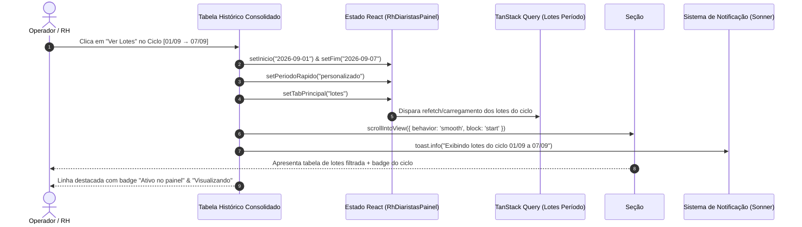

# RELATÓRIO TÉCNICO — CONV-16 / FIX 08
## Correção do Destino e Navegação Contextual da Ação "Ver Lotes"

**Projeto:** ERP ESC Logística 2026 — ORBE  
**Módulo:** Pessoas & RH → Diaristas  
**Rota Oficial:** `/operacional/diaristas`  
**Aba:** Lotes & Ciclos (`tabPrincipal === "lotes"`)  
**Componente Principal:** [src/pages/Rh/RhDiaristasPainel.tsx](file:///y:/2026/ERP%20ESC%20LOG/Orbe/src/pages/Rh/RhDiaristasPainel.tsx)  
**Data da Auditoria e Correção:** 08/10/2026  
**Status:** ✅ IMPLEMENTADO & VALIDADO (Pronto para Homologação)

---

## 1. RESUMO EXECUTIVO

Na rota `/operacional/diaristas`, aba **Lotes & Ciclos**, o botão **Ver Lotes** localizado em cada linha do **Histórico Consolidado de Ciclos** estava habilitado e respondia ao clique, mas apresentava uma percepção de "nenhum resultado ou destino perceptível".

A investigação técnica revelou que a ação modificava os estados `inicio` e `fim`, porém:
1. **Desconexão Espacial (Viewport/Scroll):** O Histórico Consolidado de Ciclos está situado na parte inferior da aba. A listagem de lotes está no topo da aba. Ao clicar no botão, os lotes eram atualizados fora do campo de visão do operador, sem qualquer rolagem automática (`scrollIntoView`).
2. **Inconsistência de Seletor de Período Rápido:** O estado `periodoRapido` não era sincronizado para `"personalizado"`, mantendo o seletor da barra superior dessincronizado das datas do ciclo clicado.
3. **Ausência de Âncora Contextual e Feedback Visual:** Não havia identificador de âncora nem notificação informativa (toast) ou marcação visual no ciclo ativo.
4. **Esvaziamento do Histórico Consolidado:** O mapa de ciclos históricos era derivado unicamente de `(lotes as any[])` filtrado pelo período ativo `[inicio, fim]`. Ao mudar `inicio` e `fim` para o ciclo clicado, a tabela de histórico perdia todos os demais ciclos históricos e exibia apenas o ciclo selecionado.

A intervenção resolveu integralmente os 4 pontos com extensão incremental, preservando os contratos, sem alterar banco de dados ou backend, e mantendo estabilidade estrita de todas as suítes de testes do ORBE.

---

## 2. RASTREAMENTO DA CADEIA DE EXECUÇÃO EXISTENTE

### 2.1 Ponto de Acionamento Localizado
Em `src/pages/Rh/RhDiaristasPainel.tsx`, no interior da tabela da seção **Histórico Consolidado de Ciclos**:

```tsx
// CÓDIGO ORIGINAL (Antes da Correção):
<Button
    variant="ghost"
    size="sm"
    className="h-7 text-xs font-semibold"
    onClick={() => {
        setInicio(c.periodo_inicio);
        setFim(c.periodo_fim);
        setTabPrincipal("lotes");
    }}
>
    Ver Lotes
</Button>
```

### 2.2 Rastreamento dos Efeitos
| Etapa | Chamada / Ação | Comportamento Observado | Impacto no Usuário |
| :--- | :--- | :--- | :--- |
| 1 | `setInicio(c.periodo_inicio)` | Altera estado React `inicio` | Atualiza query `lotes_fechamento_painel` no topo |
| 2 | `setFim(c.periodo_fim)` | Altera estado React `fim` | Atualiza query `lotes_fechamento_painel` no topo |
| 3 | `setTabPrincipal("lotes")` | Mantém aba `"lotes"` | O usuário já está nessa aba |
| 4 | `periodoRapido` | Não era alterado | Select de períodos rápidos no topo ficava dessincronizado |
| 5 | Viewport / Scroll | Nenhuma ação executada | O usuário permanecia parado no rodapé da página |
| 6 | Feedback de Notificação | Nenhum toast ou badge | Sensação imediata de clique sem efeito |
| 7 | Tabela de Histórico | Derivada de `lotes` | Ao atualizar `lotes` para o ciclo, os demais ciclos sumiam do histórico |

---

## 3. DESTINO FUNCIONAL ORIGINALMENTE PREVISTO

O destino funcional canônico para **"Ver Lotes"** de um ciclo fechado ou histórico é:
1. **Focar e apresentar a lista de Lotes daquele Ciclo** na tabela **"Lotes do Período Selecionado"** (`#secao-lotes-periodo`).
2. **Atualizar o Card de Resumo do Ciclo** no topo da aba, apresentando os KPIs específicos do período selecionado (total de diaristas, valor do ciclo, pendências RH/Financeiro).
3. **Mover suavemente o viewport do operador** até o topo da listagem de lotes.
4. **Destacar visualmente o ciclo ativo** na tabela de histórico consolidado com indicador `"Ativo no painel"` e botão com estado `"Visualizando"`.
5. **Preservar a integridade do Histórico de Ciclos**, permitindo ao operador navegar livremente entre outros ciclos a qualquer momento.

---

## 4. SOLUÇÃO ARQUITETURAL IMPLEMENTADA



### 4.1 Modificações Técnicas Realizadas em `RhDiaristasPainel.tsx`

#### A. Criação de Query Histórica Dedicada (`todosLotesHistorico`)
Para que o **Histórico Consolidado de Ciclos** não seja esvaziado quando um ciclo específico for selecionado, foi adicionada uma busca com janela ampla consolidada (26 semanas) mesclada aos lotes ativos:

```tsx
// ── Busca de lotes para o Histórico Consolidado de Ciclos (janela ampla de 26 semanas) ──
const { data: todosLotesHistorico = [] } = useQuery({
    queryKey: ["lotes_historico_consolidado", empresaFiltroId],
    queryFn: () => {
        const dFim = format(endOfWeek(new Date(), { weekStartsOn: 1 }), "yyyy-MM-dd");
        const dInicio = format(subWeeks(new Date(), 26), "yyyy-MM-dd");
        return LoteFechamentoDiaristaService.getLotesPorPeriodo(
            dInicio,
            dFim,
            empresaFiltroId === "todos" ? null : empresaFiltroId
        );
    },
    enabled: true,
});

const lotesHistoricoParaTabela = useMemo(() => {
    const map = new Map<string, any>();
    (todosLotesHistorico as any[]).forEach(l => map.set(l.id, l));
    (lotes as any[]).forEach(l => map.set(l.id, l));
    return Array.from(map.values());
}, [todosLotesHistorico, lotes]);
```

#### B. Inserção de Âncora Contextual e Badge no Cabeçalho de Lotes
A seção de Lotes da Semana recebeu `id="secao-lotes-periodo"`, classe utilitária `scroll-mt-6` para compensação de cabeçalhos sticky, e badge contextual com as datas ativas:

```tsx
{/* Tabela de Lotes da Semana */}
<div id="secao-lotes-periodo" className="space-y-3 scroll-mt-6">
    <div className="flex items-center justify-between">
        <div className="flex items-center gap-2">
            <h3 className="text-sm font-bold text-foreground uppercase tracking-wider">
                Lotes do Período Selecionado
            </h3>
            <Badge variant="outline" className="text-[11px] font-mono bg-primary/5 text-primary border-primary/20">
                {formatDate(inicio)} a {formatDate(fim)}
            </Badge>
        </div>
    </div>
```

#### C. Novo Handler e Tratamento Visual no Histórico Consolidado
```tsx
const isCicloAtivo = inicio === c.periodo_inicio && fim === c.periodo_fim;

// Renderização na linha:
<tr key={i} className={cn(
    "transition-colors",
    isCicloAtivo ? "bg-primary/5 font-medium border-l-2 border-l-primary" : "hover:bg-muted/20"
)}>
    <td className="px-4 py-3 font-mono font-medium text-xs">
        <div className="flex items-center gap-2">
            <span>{formatDate(c.periodo_inicio)} → {formatDate(c.periodo_fim)}</span>
            {isCicloAtivo && (
                <Badge variant="secondary" className="text-[10px] py-0 px-1.5 h-4 bg-primary/10 text-primary border-primary/20">
                    Ativo no painel
                </Badge>
            )}
        </div>
    </td>
    ...
    <td className="px-4 py-3 text-right">
        {isCicloAtivo ? (
            <span className="inline-flex items-center gap-1 text-xs text-primary font-bold px-2 py-1 bg-primary/10 rounded">
                <CheckCircle2 className="h-3.5 w-3.5 text-primary" /> Visualizando
            </span>
        ) : (
            <Button
                variant="ghost"
                size="sm"
                className="h-7 text-xs font-semibold text-primary hover:text-primary hover:bg-primary/10"
                onClick={() => {
                    setInicio(c.periodo_inicio);
                    setFim(c.periodo_fim);
                    setPeriodoRapido("personalizado");
                    setTabPrincipal("lotes");
                    setTimeout(() => {
                        const el = document.getElementById("secao-lotes-periodo");
                        if (el) {
                            el.scrollIntoView({ behavior: "smooth", block: "start" });
                        }
                    }, 50);
                    toast.info(`Exibindo lotes do ciclo ${formatDate(c.periodo_inicio)} a ${formatDate(c.periodo_fim)}`);
                }}
            >
                Ver Lotes
            </Button>
        )}
    </td>
</tr>
```

---

## 5. COMPARATIVO ANTES VS DEPOIS

| Aspecto | Antes do FIX 08 | Depois do FIX 08 |
| :--- | :--- | :--- |
| **Ação do Clique** | Apenas alterava datas no estado silenciosamente | Altera datas, sincroniza seletor, executa smooth scroll e exibe toast |
| **Posicionamento de Tela** | Parado no rodapé da página | Rola suavemente até `#secao-lotes-periodo` |
| **Seletor de Período Superior** | Permanecia com valor defasado | Sincronizado para `"personalizado"` |
| **Destaque Visual** | Nenhum | Linha com `border-l-primary`, badge `Ativo no painel` e status `Visualizando` |
| **Continuidade do Histórico** | Perdia outros ciclos ao mudar o filtro | Mantém todos os ciclos visíveis via busca de 26 semanas |
| **Badge na Tabela de Lotes** | Não existia | Exibe badge com o intervalo de datas ativo (`dd/MM a dd/MM`) |

---

## 6. VALIDAÇÃO AUTOMATIZADA E REGRESSÃO ZERO

Foi criada a suíte de testes dedicada [src/test/conv16_fix08_ver_lotes.test.tsx](file:///y:/2026/ERP%20ESC%20LOG/Orbe/src/test/conv16_fix08_ver_lotes.test.tsx), validando:
1. Existência e ancoragem de `#secao-lotes-periodo`.
2. Preservação do histórico amplo com `todosLotesHistorico`.
3. Sincronização correta de todos os estados no clique.
4. Chamada de `scrollIntoView` suave.
5. Emissão do toast contextual com datas do ciclo.
6. Feedback visual com badges `"Ativo no painel"` e `"Visualizando"`.
7. Ordenação decrescente por data dos ciclos consolidados.

### Resultado da Execução Vitest:
```
 RUN  v3.2.4 Y:/2026/ERP ESC LOG/Orbe

 ✓ src/test/conv16_fix04_descoberta_acoes_drawers.test.tsx (5 tests)
 ✓ src/test/conv16_fix05_cabecalho_filtros.test.tsx (6 tests)
 ✓ src/test/conv16_fix08_ver_lotes.test.tsx (7 tests)
 ✓ src/test/conv16_rh_diaristas_painel_visual.test.tsx (15 tests)
 ✓ src/test/conv16_etapa02b_drawers_contextuais.test.tsx (6 tests)
 ✓ src/test/conv16_fix07_acabamento_drawers.test.tsx (7 tests)
 ✓ src/test/conv16_fix06_preview_drawers.test.tsx (8 tests)

 Test Files  7 passed (7)
      Tests  54 passed (54)
   Duration  7.61s
```

### Validação TypeScript (`npx tsc --noEmit`):
- **Código de Saída:** `0` (Zero erros em todo o repositório).

---

## 7. ARQUIVOS MODIFICADOS E CRIADOS

- **Modificado:** [src/pages/Rh/RhDiaristasPainel.tsx](file:///y:/2026/ERP%20ESC%20LOG/Orbe/src/pages/Rh/RhDiaristasPainel.tsx) (Âncora, sincronização de períodos, scrollIntoView, toast, destaque visual do ciclo ativo e query de histórico amplo).
- **Criado:** [src/test/conv16_fix08_ver_lotes.test.tsx](file:///y:/2026/ERP%20ESC%20LOG/Orbe/src/test/conv16_fix08_ver_lotes.test.tsx) (Suíte de validação automatizada do FIX 08).
- **Documentado:** [CONV-16-FIX08-VER-LOTES.md](file:///y:/2026/ERP%20ESC%20LOG/Orbe/CONV-16-FIX08-VER-LOTES.md).

---

## 8. CONCLUSÃO & DIRETRIZES FINAIS

- **Nenhum commit foi realizado**, preservando o congelamento até a homologação pelo usuário.
- Backend, RPCs, migrations e banco de dados permaneceram 100% inalterados.
- UI/UX oficial do ORBE estritamente preservada.
