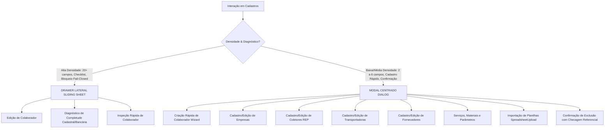

# ERP ORBE — CONV-19 / ETAPA 01
# AUDITORIA ESTRUTURAL E PLANO DE CONVERGÊNCIA DA CENTRAL DE CADASTROS

**Projeto:** ERP ORBE — ESC Logística 2026  
**Módulo:** Cadastros & Sistema → Central de Cadastros  
**Rota Oficial:** `/cadastros` (`src/pages/CentralCadastros.tsx`)  
**Data da Auditoria:** 10/10/2026  
**Natureza:** Auditoria Estrutural e Planejamento de Convergência UI/UX — **Estritamente Read-Only** (Sem alteração de código, banco de dados ou regras de negócio).

---

## 1. Inventário Detalhado dos Cadastros

A Central de Cadastros concentra a administração mestre de todas as entidades operacionais, pessoas, infraestrutura de ponto e parâmetros de tarifação do ERP ORBE. O módulo é composto atualmente por 8 abas de primeiro nível e 3 sub-abas paramétricas em um único arquivo de 5.757 linhas ([`src/pages/CentralCadastros.tsx`](file:///y:/2026/ERP%20ESC%20LOG/Orbe/src/pages/CentralCadastros.tsx)).

### 1.1 Matriz de Entidades e Componentes

| Aba | Entidade Mestre | Tabela PostgreSQL | Serviço Primário | Componente de Criação | Componente de Edição | Tipo de Interação Recomendada |
|---|---|---|---|---|---|---|
| **Colaboradores** | Equipe Operacional (CLT, Intermitente, Diarista) | `colaboradores` | `ColaboradorService` / `core.service.ts` | Modal Wizard em 2 etapas (`colaboradorModalOpen`) | Modal Inline comprimido (520px) | **DRAWER LATERAL (`Sheet`)** para edição e diagnóstico de completude |
| **Empresas** | Unidades Operacionais e Contratantes | `empresas` | `EmpresaService` | Modal Focado (`empresaModalOpen`) | Modal Focado (`editingEmpresa`) | **MODAL FOCADO (`Dialog`)** |
| **Coletores** | Dispositivos REP e Diretórios AFD | `coletores` | `ColetorService` / `UnidadeOperacionalService` | Modal Técnico (`coletorModalOpen`) | Modal Técnico (`coletorModalOpen`) | **MODAL FOCADO (`Dialog`)** |
| **Transportadoras** | Clientes e Transportadoras Parceiras | `transportadoras_clientes` | `TransportadoraClienteService` | Modal Padrão (`transportadoraModalOpen`) | Modal Padrão (`editingTransportadora`) | **MODAL FOCADO (`Dialog`)** |
| **Fornecedores** | Fornecedores de Insumos e Serviços | `fornecedores` | `FornecedorService` | Modal Padrão (`fornecedorModalOpen`) | Modal Padrão (`editingFornecedor`) | **MODAL FOCADO (`Dialog`)** |
| **Serviços** | Tipos de Serviço Operacional | `tipos_servico_operacional` | `TipoServicoOperacionalService` | Modal Simples (`servicoModalOpen`) | Modal Simples (`editingServico`) | **MODAL RÁPIDO (`Dialog`)** |
| **Materiais** | Materiais e Insumos (Pallets, Stretch) | `materiais_operacionais` | `MateriaisOperacionaisService` | Modal Simples (`materialModalOpen`) | Modal Simples (`editingMaterial`) | **MODAL RÁPIDO (`Dialog`)** |
| **Parâmetros** | Tipos de Operação, Produtos de Carga, Tipos de Dia | `config_tipos_operacao`, `config_produtos`, `config_tipos_dia` | `ConfigTipoOperacaoService`, `ConfigProdutoService`, `ConfigTipoDiaService` | Modal de Parâmetro (`configModalOpen`) | Modal de Parâmetro (`editingConfig`) | **MODAL FOCADO (`Dialog`)** |

---

### 1.2 Detalhamento Específico por Entidade

#### 1. Colaboradores (`tab="colaboradores"`)
- **Campos Principais:** `nome`, `nome_completo`, `cpf`, `pis`, `telefone`, `cargo`, `matricula`, `empresa_id`, `tipo_colaborador` (`CLT`, `INTERMITENTE`, `DIARISTA`, `PRODUÇÃO`, `TERCEIRIZADO`), `regime_trabalho`, `modelo_calculo` (`Mensal`, `Horista`, `Produção`, `Diária`), `tipo_contrato` (`Hora`, `Operação`, `Mensal`), `valor_base`, `salario_base`, `valor_hora`, `valor_diaria`, `carga_referencia` (padrão 220h), `flag_faturamento` (`gera_faturamento`), `permitir_lancamento_operacional`, `status` (`ativo`, `inativo`), `status_cadastro` (`pendente_complemento`), `cadastro_provisorio` (`boolean`), `banco_codigo`, `agencia`, `agencia_digito`, `conta`, `conta_digito`, `tipo_conta` (`corrente`, `poupanca`), `chave_pix`.
- **Validações:**
  - CPF obrigatório com higienização de máscara (11 dígitos numéricos) e verificação de duplicidade por tenant.
  - Telefone (10 ou 11 dígitos com DDD).
  - Vínculo mandatório com `empresa_id`.
  - Dados bancários estritos para liberação financeira: Código de banco (3 dígitos), Agência (3 a 6 dígitos + DV opcional), Conta (3 a 20 dígitos + DV obrigatório 1 a 2 caracteres alfanuméricos), Tipo de conta (`corrente` ou `poupanca`).
- **Dependências Transversais:**
  - **RH / Ponto CLT:** Bloqueia apuração e fechamento se `status_cadastro = 'pendente_complemento'` ou `cadastro_provisorio = true`.
  - **Intermitentes:** Bloqueia aprovação de lotes (*Fail-Closed*) se colaboradores envolvidos não possuírem CPF ou conta bancária.
  - **Diaristas:** Exige presença em cadastro ativo para constar na grade semanal.
  - **Central Bancária / CNAB 240:** Registros bancários alimentam o Segmento A do arquivo de remessa.
- **Permissões:** Perfis `admin` e `rh` possuem gestão completa; outros perfis possuem acesso bloqueado ou modo somente leitura.

#### 2. Empresas (`tab="empresas"`)
- **Campos Principais:** `nome`, `cnpj`, `unidade`, `cidade`, `estado`, `status`, `banco_codigo`, `agencia`, `agencia_digito`, `conta`, `conta_digito`, `convenios_bancario`, `codigo_empresa_banco`, `nome_empresa_banco`, `tenant_id`.
- **Validações:** CNPJ obrigatório com validação matemática de dígitos verificadores e detecção de sequências repetidas; sanitização rigorosa via `sanitizeEmpresaPayload` para evitar envio de colunas inválidas ao PostgREST.
- **Dependências Transversais:** Atua como partição mestra de dados em todo o ERP (operações, pontos, lotes de folha, faturamento, DRE).
- **Permissões:** `admin` e `financeiro`.

#### 3. Coletores (`tab="coletores"`)
- **Campos Principais:** `modelo`, `serie`, `empresa_id`, `unidade_id`, `unidade_local`, `fabricante`, `tipo_integracao` (`upload_manual`, `api`, `diretorio`), `formato_arquivo` (`AFD`), `integracao_ativa`, `intervalo_sincronizacao_minutos`, pastas de processamento (`folder_entrada_url`, `folder_processados_url`, `folder_erros_url`).
- **Validações:** Modelo, número de série e vínculo com empresa obrigatórios.
- **Dependências Transversais:** Motor de Ponto CLT e importações de espelho/AFD.
- **Permissões:** Restrito a `admin`.

#### 4. Transportadoras (`tab="transportadoras"`)
- **Campos Principais:** `nome`, `cnpj`, `telefone`, `email`, `endereco`, `cidade`, `estado`, `ativo`, `tenant_id`, `empresa_id`.
- **Validações:** Normalização e validação via [`transportadoraValidation.ts`](file:///y:/2026/ERP%20ESC%20LOG/Orbe/src/utils/transportadoraValidation.ts) com checagem de CNPJ/CPF válido e unicidade.
- **Dependências Transversais:** Operações por Volume, Faturamento a Clientes, Tabelas de Preço.
- **Permissões:** `admin` e `operacional`.

#### 5. Fornecedores (`tab="fornecedores"`)
- **Campos Principais:** `nome`, `cpf_cnpj`, `telefone`, `email`, `contato`, `categoria`, `ativo`, `tenant_id`, `empresa_id`.
- **Validações:** Formatação e validação de CPF/CNPJ via [`fornecedorValidation.ts`](file:///y:/2026/ERP%20ESC%20LOG/Orbe/src/utils/fornecedorValidation.ts).
- **Dependências Transversais:** Lançamento de Custos Extras, Faturamento, Despesas e Contas a Pagar.
- **Permissões:** `admin` e `operacional`.

#### 6. Serviços Operacionais (`tab="servicos"`)
- **Campos Principais:** `nome`, `codigo`, `descricao`, `ativo`, `tipo_cobranca`, `permite_rateio`.
- **Validações:** Nome e código únicos por tenant; rotina de saneamento para desambiguação de duplicatas históricas (ex.: "Descarga").
- **Dependências Transversais:** Lançamento de Serviços Extras e Operações por Volume.
- **Permissões:** `admin` e `operacional`.

#### 7. Materiais Operacionais (`tab="materiais"`)
- **Campos Principais:** `nome`, `codigo`, `unidade_medida`, `preco_referencia`, `ativo`.
- **Validações:** Descrição e unidade de medida obrigatórios.
- **Dependências Transversais:** Custos Extras e insumos de expedição (Filme Stretch, pallets).
- **Permissões:** `admin` e `operacional`.

#### 8. Parâmetros Operacionais (`tab="parametros"`)
- **Sub-abas:**
  - `operacao`: Tipos de Operação (`ConfigTipoOperacaoService`) com validação de código e duplicidade.
  - `produtos`: Produtos de Carga (`ConfigProdutoService` e `ProdutoCargaService`) com diálogo de amarração de preços a transportadoras/fornecedores.
  - `dia`: Tipos de Dia (`ConfigTipoDiaService`) para governança de multiplicadores de jornada.
- **Permissões:** Restrito a `admin`.

---

## 2. Auditoria dos Fluxos Contextuais Receptores

A Central de Cadastros é o ponto de convergência de todos os alertas e bloqueios gerados pelos módulos operacionais e de controladoria.

### 2.1 Mapa de Rotas de Origem e Parâmetros

| Módulo de Origem | Rota Disparadora | Parâmetros Enviados na URL | Intenção Contextual | Comportamento Atual no Destino | Diagnóstico da Auditoria |
|---|---|---|---|---|---|
| **Fechamento Mensal CLT** | `/banco-horas/fechamento` | `?from=fechamento-clt`<br>ou `?colaboradorId={id}&openModal=true&section={sec}&from=processamento-rh` | Resolver pendência cadastral que impede o fechamento mensal da folha | Captura `colaboradorId`, abre modal de 520px e exibe banner âmbar de retorno | **Parcialmente Rígido:** Se o usuário fechar o modal ou recarregar a página, os parâmetros são removidos da URL imediatamente (`newParams.delete`) e o contexto se perde. |
| **Ponto & Jornadas CLT** | `/clt/pontos` | `?tab=colaboradores&colaboradorId={id}&openModal=true&from=clt-pontos` | Corrigir PIS, matrícula ou dados de jornada de colaborador apontado | Abre modal de edição e define `returnToContext = 'clt-pontos'` | **Funcional, porém apertado:** O modal espreme 20 campos em 520px com rolagem interna excessiva. |
| **Central de Inconsistências** | `/inconsistencias` | `?tab=colaboradores&colaboradorId={id}&openModal=true` | Tratar inconsistência de colaborador sem vínculo ou sem CPF | Abre modal de edição se o `colaboradorId` for encontrado | **Sem Banner de Retorno:** Como `from` não é `"processamento-rh"` nem `"clt-pontos"`, o usuário não recebe botão para voltar à Central de Inconsistências. |
| **Central de Aprovações RH** | `/rh/aprovacoes` | `AprovacaoDecisaoDrawer` identifica pendência *Fail-Closed* em lote | Orientar o saneamento cadastral de diaristas ou intermitentes | Atualmente não dispara deep link com query params automatizados para a linha do colaborador | **Lacuna Ergonômica:** O usuário precisa navegar manualmente até `/cadastros` e pesquisar pelo nome do colaborador com pendência. |
| **Regime Intermitente** | `/operacional/intermitentes/lotes` | CTA do Drawer Primário para lotes pendentes | Resolver CPF/dados bancários faltantes para liberação bancária | Acesso manual pelo menu lateral | **Lacuna Contextual:** Necessita de link direto com preenchimento de `colaboradorId` e retorno para a esteira de intermitentes. |
| **Operações por Volume** | `/operacoes-volume` | Links de empresas/transportadoras não cadastradas | Cadastro rápido de cliente ou produto | Utiliza `QuickRegisterDialog` modal local | **Homologado e Preservado:** Cadastro auxiliar in-place funciona de forma isolada e não interfere na Central de Cadastros. |

### 2.2 Preservação da Navegação Homologada na CONV-17
Na CONV-17, foi estabelecido que:
1. Navegações contextuais transmitem parâmetros tanto por `searchParams` (`?param=val`) quanto por `location.state` (`history.state`).
2. O botão de retorno deve restabelecer o filtro de competência e a empresa da esteira de origem.
3. A Central de Cadastros **deve suportar explicitamente** os valores de retorno:
   - `from=processamento-rh` → Retorna para `/banco-horas/processamento`
   - `from=clt-pontos` → Retorna para `/clt/pontos`
   - `from=fechamento-clt` → Retorna para `/banco-horas/fechamento`
   - `from=inconsistencias` → Retorna para `/inconsistencias`
   - `from=aprovacoes` → Retorna para `/rh/aprovacoes`
   - `from=intermitentes` → Retorna para `/operacional/intermitentes/lotes`

---

## 3. Auditoria Visual vs. Design System Oficial

A inspeção comparativa entre [`CentralCadastros.tsx`](file:///y:/2026/ERP%20ESC%20LOG/Orbe/src/pages/CentralCadastros.tsx) e os módulos de referência homologados ([`Dashboard.tsx`](file:///y:/2026/ERP%20ESC%20LOG/Orbe/src/pages/Dashboard.tsx), [`FechamentoMensalCLT.tsx`](file:///y:/2026/ERP%20ESC%20LOG/Orbe/src/pages/BancoHoras/FechamentoMensalCLT.tsx) e [`CentralBancaria.tsx`](file:///y:/2026/ERP%20ESC%20LOG/Orbe/src/pages/CentralBancaria.tsx)) revela contrastes visuais substanciais:

```text
┌─────────────────────────────────────────────────────────────────────────────────────────┐
│ PADRÃO EXECUTIVO ORBE (Homologado nas CONV-01 a CONV-17)                                 │
├─────────────────────────────────────────────────────────────────────────────────────────┤
│ 1. Header Oficial: AppShell institucional com seletor de empresa e ações globais        │
│ 2. Síntese Superior: Exatamente 4 OrbeKpiCard corporativos (Total, Ativos, Alertas, ...) │
│ 3. Workspace: Abas em pílula com contadores de registros e busca unificada              │
│ 4. Tabela: Linhas compactas, StatusBadge semântico e ações contextuais na linha         │
│ 5. Interações Críticas: Drawer Lateral deslizante (Sheet) com checklist de completude   │
└─────────────────────────────────────────────────────────────────────────────────────────┘
                                           VS
┌─────────────────────────────────────────────────────────────────────────────────────────┐
│ IMPLEMENTAÇÃO ATUAL DA CENTRAL DE CADASTROS (src/pages/CentralCadastros.tsx)           │
├─────────────────────────────────────────────────────────────────────────────────────────┤
│ 1. Header: Bloco esc-card simples com links externos desalinhados                      │
│ 2. Indicadores: Grid desproporcional de 8 mini MetricCards sem semântica cromática      │
│ 3. Abas: 8 abas com quebra de linha visual desordenada (flex-wrap h-auto)               │
│ 4. Tabelas: Heterogêneas, algumas com paginação e outras sem limite de altura           │
│ 5. Interações: 13 Modais flutuantes (Dialog) sobrepostos, incluindo form de 20 campos   │
└─────────────────────────────────────────────────────────────────────────────────────────┘
```

### 3.1 Classificação Técnica: Modal vs. Drawer

A auditoria determina tecnicamente quais interações devem migrar para Drawer e quais devem permanecer estritamente como Modal:



#### Justificativa da Classificação:
1. **Edição de Colaboradores como Drawer Lateral (`Sheet`):**  
   O colaborador é a entidade mais complexa do sistema, acumulando dados civis, contratos CLT/intermitente/diarista, remuneração e domicílio bancário CNAB. Quando aberto em um modal de 520px, a leitura é prejudicada. Um Drawer lateral de `w-[600px]` permite exibir o diagnóstico de completude no topo, seções organizadas (Identificação, Contrato, Dados Bancários) e rodapé com botões de ação e retorno contextual preservado.
2. **Preservação de Modais para as demais 7 entidades:**  
   Empresas, transportadoras, fornecedores, serviços e coletores possuem formulários concisos (3 a 8 campos). Migrá-los para Drawer criaria áreas em branco excessivas sem benefício ergonômico. Modais centralizados (`max-w-md` ou `max-w-lg`) são rápidos, focados e ideais para cadastros diretos.

---

## 4. Auditoria de Integridade Funcional e Riscos

### 4.1 Riscos de Domínio e Governança

1. **Risco de Modelos de Remuneração Divergentes:**
   - O cadastro de colaboradores aceita `tipo_colaborador` (`CLT`, `INTERMITENTE`, `DIARISTA`, `PRODUÇÃO`, `TERCEIRIZADO`) e `modelo_calculo` (`Mensal`, `Horista`, `Produção`, `Diária`).
   - *Risco:* Inconsistência entre regime e modelo (ex.: Colaborador CLT com modelo `Diária` ou Diarista com modelo `Mensal`) causa quebra de cálculo no Motor RH ou nas regras de fechamento.
   - *Salvaguarda:* O componente já possui as funções de inferência `inferRegimeTrabalho` e `inferModeloCalculo`. Estas funções **devem ser estritamente preservadas**.
2. **Risco de Integridade Bancária (Validação CNAB 240):**
   - As funções `getColaboradorBankValidation` e `getBankBadgeUi` auditam regex de agência, conta e dígito verificador.
   - *Risco:* Relaxar as validações bancárias permitirá salvar dados incompletos que irão gerar rejeição no arquivo de remessa CNAB na Central Bancária.
   - *Salvaguarda:* Manter intactas as regras de validação bancária e a sinalização de *"Dados incompletos"* / *"Formato inválido"*.
3. **Risco de Bloqueios Fail-Closed:**
   - O método `getColaboradorOperationalMeta` apura se o cadastro bloqueia RH ou Financeiro.
   - *Risco:* Ocultar as pendências ou permitir aprovação forçada gerará distorções em cascata no Fechamento CLT e na Central de Aprovações.
   - *Salvaguarda:* Manter a exibição fidedigna do `EntityCompletenessPanel`.
4. **Isolamento Multitenant e Partição por Empresa:**
   - Todas as queries do `ColaboradorService`, `EmpresaService` e coletores devem manter o filtro mandatório por `tenant_id` e respeitar o `empresa_id` do usuário quando em sessão restrita.

### 4.2 Registro Obrigatório: Empresas Provisórias como `Operacional,Castanhal`

Durante as auditorias da **CONV-15** e da **CONV-17**, foram identificadas entidades na tabela `empresas` com nomenclatura resultante de importação legada concatenada por vírgula:
- `Castanhal,Operacional` (`id: 32e359fc-743a-4fdf-a5c9-dc3be5f7d482`)
- `Operacional,Castanhal` (`id: 2d67a910-c329-45df-8330-e8bce09a8ee4`)

#### Parecer Obrigatório de Integridade:
> ⚠️ **RESTRIÇÃO CRÍTICA DE DOMÍNIO:**  
> A Central de Cadastros **NÃO DEVE** realizar merge automático, consolidação silenciosa ou exclusão dessas empresas durante a convergência visual.  
> Registros históricos de ponto, jornadas de intermitentes e lançamentos operacionais estão fisicamente amarrados a esses IDs por chave estrangeira.  
> Qualquer tentativa de exclusão ou unificação sem migração assistida de banco causará violação de integridade referencial (*Foreign Key Violation*) ou geração de registros órfãos.  
> A interface do ORBE deve continuar exibindo fidedignamente o registro cadastral exatamente como existe no banco de dados.

---

## 5. Proposta de Implementação Incremental (CONV-19)

Para garantir convergência visual impecável sem nenhum risco de quebra nos contratos existentes, a implementação da **CONV-19** deve ser dividida em 5 etapas progressivas:

```text
CONV-19: Pipeline de Convergência da Central de Cadastros
┌────────────────────────────────────────────────────────────────────────┐
│ Etapa 01: Auditoria Estrutural e Matriz de Riscos (Concluída - Leitura) │
├────────────────────────────────────────────────────────────────────────┤
│ Etapa 02: Convergência do Shell, Header e 4 OrbeKpiCard Corporativos   │
├────────────────────────────────────────────────────────────────────────┤
│ Etapa 03: Padronização das Abas, Busca e Layouts de Tabela             │
├────────────────────────────────────────────────────────────────────────┤
│ Etapa 04: Desacoplamento Cirúrgico do CadastroColaboradorDrawerOficial │
├────────────────────────────────────────────────────────────────────────┤
│ Etapa 05: Integração Contextual Receptora e Suíte Automatizada         │
└────────────────────────────────────────────────────────────────────────┘
```

### 5.1 Divisão Cirúrgica das Mudanças

#### A. Mudanças Exclusivamente Visuais (Zero Risco Funcional):
1. Substituir a seção superior rústica pelo cabeçalho executivo institucional sob `AppShell`.
2. Substituir o grid de 8 mini `MetricCard`s por **4 `OrbeKpiCard`s corporativos**:
   - **Total de Colaboradores** (Contador geral com distinção ativos/inativos)
   - **Prontos para Folha/Operação** (Cadastros 100% íntegros sem bloqueio)
   - **Pendências Cadastrais / RH** (Colaboradores com cadastro provisório ou dados pendentes)
   - **Pendências Bancárias / Fin** (Colaboradores ativos sem conta bancária ou sem PIX)
3. Organizar a barra de abas em pílula com rolagem suave sem quebras de linha desalinhadas.
4. Aplicar tokens visuais e semântica de cores oficial (`success`, `warning`, `danger`, `neutral`).

#### B. Mudanças Estruturais / Ergonômicas (Preservando Contratos):
1. **Criação do Componente Desacoplado:**  
   `src/components/cadastros/CadastroColaboradorDrawerOficial.tsx`  
   Mover o formulário de edição de colaborador para um Drawer lateral deslizante (`Sheet`), incorporando o checklist de completude no topo, abas internas para separar Identificação, Contrato e Banco, e rodapé com botões de ação e retorno contextual.
2. **Preservação Integral dos Modais Menores:**  
   Manter os modais existentes para Empresas, Coletores, Transportadoras, Fornecedores, Serviços, Materiais e Parâmetros, aplicando apenas acabamento visual limpo.
3. **Preservação Absoluta dos Services:**  
   Nenhum método de `ColaboradorService`, `EmpresaService` ou `TransportadoraClienteService` será alterado em suas assinaturas.
4. **Suíte de Testes Automatizada:**  
   Criação de [`src/test/conv19_central_cadastros.test.tsx`](file:///y:/2026/ERP%20ESC%20LOG/Orbe/src/test/conv19_central_cadastros.test.tsx) cobrindo a renderização dos 4 KPIs, a navegação entre as 8 abas, a abertura contextual do Drawer por query params e a preservação de dados.

---

## 6. Proposta da Próxima Ação Imediata

Concluída a auditoria de leitura, propõe-se submeter à autorização a execução da:

### **CONV-19 — ETAPA 02: Convergência do Cabeçalho, KPIs Executivos e Navegação de Abas**
- **Foco:** Substituir o bloco superior e os 8 mini-cards pelos 4 `OrbeKpiCard`s padronizados, alinhar o container de abas e integrar a barra de pesquisa sem alterar os formulários internos ou mutações.
- **Risco:** Zero (apenas composição visual sob `AppShell`).

---

## 7. Parecer Técnico e Encerramento

> **PARECER FINAL DA AUDITORIA:**  
> A Central de Cadastros é robusta em termos de regras de negócio e validações bancárias/fiscais, porém apresenta defasagem ergonômica severa devido ao acúmulo de formulários densos em modais apertados de 520px e à ausência dos 4 KPIs corporativos do Design System.  
> A migração da edição de colaboradores para um Drawer lateral especializado resolverá a maior fricção de usabilidade do ERP ORBE, integrando de forma fluida os fluxos de resolução de bloqueios do Fechamento CLT e da Central de Inconsistências.  
>  
> **Nenhuma linha de código foi alterada nesta etapa (Strictly Read-Only).**  
> Relatório concluído e aguardando autorização expressa para o início da implementação.
