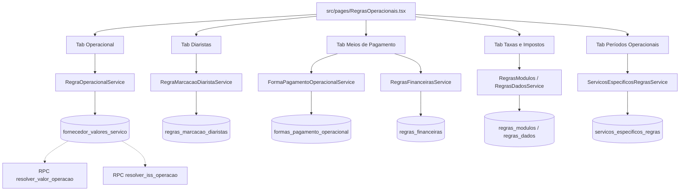

# ERP ORBE — CONV-20 / ETAPA 01
# AUDITORIA E PREPARAÇÃO DA CONVERGÊNCIA DE REGRAS & TABELAS OPERACIONAIS

**Projeto:** ERP ORBE — ESC Logística 2026  
**Módulo:** Cadastros & Sistema → Regras & Tabelas Operacionais  
**Rota Oficial:** `/cadastros/regras-operacionais`  
**Componente Principal:** [`src/pages/RegrasOperacionais.tsx`](file:///y:/2026/ERP%20ESC%20LOG/Orbe/src/pages/RegrasOperacionais.tsx)  
**Data da Auditoria:** 10 de Outubro de 2026  
**Natureza:** Auditoria Estrutural, Diagnóstico UI/UX e Planejamento de Convergência — **Estritamente Read-Only** (Sem alteração de código de produção, banco de dados, RPCs ou contratos financeiros).

---

## 1. RESUMO EXECUTIVO

Em conformidade com as diretrizes da iniciativa de Convergência Visual do ERP ORBE e dando sequência à consolidação da **CONV-19** (commit `66f4782`), foi executada a auditoria completa de leitura, arquitetura e interface da tela de **Regras & Tabelas Operacionais** (`/cadastros/regras-operacionais`).

Esta tela é o **coração tarifário e de parametrização operacional do ERP ORBE**. Nela residem os valores unitários de movimentação logística, os multiplicadores de diárias de diaristas, as formas de pagamento com seus prazos de vencimento comercial (duplicatas D+N), os impostos operacionais (ISS) e os multiplicadores de turnos e períodos de serviços específicos (D1, D2, N1, N2).

A auditoria confirma que:
1. **As regras de negócio e integrações estão ativas e críticas:** O módulo alimenta diretamente o motor de cálculo de Operações por Volume, Serviços Extras, Custos Extras, Apuração de Diaristas, Faturamento a Clientes e DRE Operacional via RPCs dedicadas (`resolver_valor_operacao`, `resolver_iss_operacao`).
2. **Existe divergência estética expressiva em relação ao Design System Canônico:** A tela não possui KPIs corporativos de topo, apresenta badges com raios inconsistentes e cores saturadas (`bg-emerald-500`, `bg-blue-100 text-blue-800`), dropdowns enganosos de 3 pontos nas abas fixas que apenas exibem alertas de bloqueio, ação de "+ Nova Aba" poluindo a barra de navegação, tabelas extensas sem paginação e quebra horizontal com truncamento de ações na resolução 1366×768 (HD corporativo).
3. **A convergência deve ser estritamente visual e incremental:** Nenhuma fórmula, preço, vigência, contrato financeiro, tabela PostgreSQL ou RPC deve ser modificada.

---

## 2. REFERÊNCIAS DO DESIGN SYSTEM CANÔNICO

A auditoria utilizou como referências obrigatórias e inegociáveis:
- [`src/pages/Dashboard.tsx`](file:///y:/2026/ERP%20ESC%20LOG/Orbe/src/pages/Dashboard.tsx) (Painel Executivo)
- [`src/components/ux-lab/design-system/tokens.ts`](file:///y:/2026/ERP%20ESC%20LOG/Orbe/src/components/ux-lab/design-system/tokens.ts) (Matriz oficial de tokens)
- [`src/components/ux-lab/uxLabThemeGuidelines.ts`](file:///y:/2026/ERP%20ESC%20LOG/Orbe/src/components/ux-lab/uxLabThemeGuidelines.ts) (Diretrizes fundamentais do tema)
- [`src/components/dashboard/ExecutiveMetricCard.tsx`](file:///y:/2026/ERP%20ESC%20LOG/Orbe/src/components/dashboard/ExecutiveMetricCard.tsx) / [`src/components/ux-lab/design-system/OrbeKpiCard.tsx`](file:///y:/2026/ERP%20ESC%20LOG/Orbe/src/components/ux-lab/design-system/OrbeKpiCard.tsx) (Cards de síntese)
- [`src/pages/CentralCadastros.tsx`](file:///y:/2026/ERP%20ESC%20LOG/Orbe/src/pages/CentralCadastros.tsx) (Homologada na CONV-19)
- [`src/pages/Colaboradores.tsx`](file:///y:/2026/ERP%20ESC%20LOG/Orbe/src/pages/Colaboradores.tsx) (Gestão Detalhada homologada na CONV-19)

### 2.1 Matriz de Tokens Oficiais

| Domínio | Token Canônico | Aplicação e Diretriz |
| :--- | :--- | :--- |
| **Filosofia Visual** | `uxLabThemeGuidelines.ts` | *"Neutro por padrão. Cor por significado. Azul representa identidade e interação institucional, sem substituir cores semânticas."* |
| **Identidade Cromática** | Royal Blue `#2563EB` | Utilizada em CTAs primários, anel de seleção ativa (`ring-1 ring-blue-600/40`), foco e navegação ativa. Não usar para dados comuns. |
| **Escala de Raios** | `ORBE_RADIUS_SCALE` | • `xs`: `rounded-[4px]` (micro-chips técnicos, multiplicadores mono) • `sm`: `rounded-[6px]` (badges de status e pills semânticas) • `md`: `rounded-lg` (8px - inputs, selects, botões) • `lg`: `rounded-xl` (12px - cards executivos, superfícies de agrupamento, modais) |
| **Escala Tipográfica** | `ORBE_TYPOGRAPHY_SCALE` | • `pageTitle`: `text-lg sm:text-xl font-bold tracking-tight text-foreground` • `kpiNumber`: `font-display text-2xl font-bold tracking-tight text-foreground sm:text-[26px]` • `label`: `text-[11px] font-semibold text-muted-foreground uppercase tracking-wider` • `monoTechnical`: `text-xs font-mono font-medium text-foreground` (valores, prazos D+N, multiplicadores) |
| **Matriz Semântica** | `ORBE_SEMANTIC_MATRIX` | Cores atenuadas/pastéis com contraste legível. Eliminar fundos saturados (`bg-emerald-500`, `bg-blue-600`) em chips informativos. |
| **Paginação Canônica** | `15 / 25 / 50 / 100` | Paginação obrigatória em todas as listagens para evitar sobrecarga de renderização e perda de cabeçalho. |

---

## 3. INVENTÁRIO FUNCIONAL DETALHADO DE REGRAS OPERACIONAIS

A tela [`src/pages/RegrasOperacionais.tsx`](file:///y:/2026/ERP%20ESC%20LOG/Orbe/src/pages/RegrasOperacionais.tsx) (3.150 linhas) estrutura-se sob o container [`AppShell`](file:///y:/2026/ERP%20ESC%20LOG/Orbe/src/components/layout/AppShell.tsx) com `backPath="/cadastros"`, orquestrando 5 abas fixas de primeiro nível e suporte a abas dinâmicas customizadas.

### 3.1 Mapeamento das Abas e Submódulos

| Aba (Slug) | Descrição do Negócio | Tabela PostgreSQL Subjacente | Serviço de Domínio | Formulário / Interação | Estado Atual de Interface |
| :--- | :--- | :--- | :--- | :--- | :--- |
| **1. Operacional** (`operacional`) | Regras de tarifação por volume, diária, operação ou colaborador. Combina empresa, tipo de serviço, transportadora, fornecedor, produto de carga, variável e vigência. | `fornecedor_valores_servico` | `RegraOperacionalService` (`producao.service.ts`) | Modal Stepper em 4 etapas (`Dialog` max-w 700px) + QuickCreate (`Dialog` 520px) | Tabela extensa sem paginação, 1 busca simples, badges despadronizados. Trunca em 1366×768. |
| **2. Diaristas** (`diaristas`) | Códigos de marcação da grade semanal de diaristas (P, MP, HE, etc.), descrições e multiplicadores sobre a diária base. | `regras_marcacao_diaristas` | `RegraMarcacaoDiaristaService` | Modal Focado (`Dialog` 450px) | Tabela sem paginação, badge `Global` azul saturado, botões de ação com texto misturado com ícone. |
| **3. Meios de Pagamento** (`meios_pagamento`) | • Meios de pagamento operacionais (PIX, Boleto, Dinheiro, etc.). • Prazos comerciais de vencimento de duplicatas (D+N global e personalizado por empresa). | • `formas_pagamento_operacional` • `regras_financeiras` | • `FormaPagamentoOperacionalService` • `RegrasFinanceirasService` | • Modal Meio de Pagamento (`Dialog`) • Modal Prazo Duplicata (`Dialog`) | Duas seções empilhadas na mesma aba com 2 tabelas independentes, sem paginação, badges heterogêneos. |
| **4. Taxas e Impostos** (`taxas_impostos`) | Alíquotas e incidências de taxas e impostos operacionais (destaque para ISS e base de cálculo). | `regras_modulos`, `regras_campos`, `regras_dados` | `RegrasModulosService`, `RegrasDadosService` | Modal Dinâmico de Linha (`Dialog`) | Renderizado via `DynamicRuleTabContent` com módulo fixo `module_type: 'tax'`. Tabela sem paginação. |
| **5. Períodos Operacionais** (`especificos`) | Períodos/turnos operacionais tabelados (D1, D2, N1, N2) e multiplicadores de turno aplicados à operação e equipe. | `servicos_especificos_regras` | `ServicosEspecificosRegrasService` | Inserção e edição inline diretamente nas linhas da tabela | Tabela com estilo e tipografia destoantes, texto azul em códigos, banner explicativo com padding irregular. |
| **6. Abas Dinâmicas** (`{slug}`) | Módulos customizados de regras criados em tempo de execução pelo usuário. | `regras_modulos`, `regras_campos`, `regras_dados` | `RegrasModulosService` | Modal de Gerenciamento de Campos e Dados | Container `DynamicRuleTabsContainer`. |

---

### 3.2 Tabelas PostgreSQL, Serviços e RPCs Envolvidas

- **Tabela Principal `fornecedor_valores_servico`:**
  - Chaves estrangeiras: `empresa_id`, `unidade_id`, `tipo_servico_id`, `transportadora_id`, `fornecedor_id`, `produto_carga_id`, `tipo_regra_id`, `forma_pagamento_id`.
  - Campos de cálculo: `tipo_calculo` (`volume`, `daily`, `operation`, `colaborador`), `valor_unitario` (`numeric`), `vigencia_inicio` (`date`), `vigencia_fim` (`date` opcional), `ativo` (`boolean`).
  - Constraint de conflito: `hasActiveConflict` checa sobreposição de datas para a mesma tupla operacional.
- **RPC `resolver_valor_operacao`:**
  - Assinatura: `(p_empresa_id, p_unidade_id, p_tipo_servico_id, p_fornecedor_id, p_transportadora_id, p_produto_carga_id, p_data_operacao)`
  - Retorno: Valor unitário resolvido com base na regra vigente de maior especificidade.
- **RPC `resolver_iss_operacao`:**
  - Assinatura: `(p_empresa_id, p_tipo_servico_id, p_data_operacao)`
  - Retorno: Alíquota e percentual de ISS aplicável à operação.

---

### 3.3 Formulários, Modais e Drawers Existentes

| Identificador | Componente | Gatilho | Responsabilidade | Comportamento Atual |
| :--- | :--- | :--- | :--- | :--- |
| `isModalOpen` | `Dialog` (Wizard 4 etapas) | CTA "+ Nova Regra" ou Ação "Editar" na linha | Criação e edição guiada de regras de tarifação operacional | Exibe stepper (Escopo → Serviços → Parâmetros → Validade). Funciona bem funcionalmente, porém estilização do stepper e caixas de alerta usam cores e bordas fora do padrão. |
| `quickCreate` | `Dialog` (520px) | Botão "Novo" dentro do combobox `QuickCreateLookup` | Cadastro rápido de transportadora, serviço, fornecedor, produto, forma de pagamento ou tipo de regra | Cadastro auxiliar ágil que previne perda de foco do formulário principal. |
| `ruleToDelete` | `AlertDialog` | Botão "Excluir" na linha | Confirmação irreversível de exclusão de regra | Caixa de confirmação padrão com resumo da regra. |
| `importModalOpen` | `SpreadsheetUploadModal` | CTA "Importar Planilha" | Carga massiva de regras via Excel/CSV com fuzzy matching e validação em tempo real | Modal oficial compartilhado já homologado. Preservar 100%. |
| `isNewTabModalOpen` | `Dialog` (425px) | Botão "+ Nova Aba" na lista de abas | Criação de novo módulo dinâmico | Formulário simples de nome, slug e descrição. |
| Modal Diaristas | `Dialog` (Tab Diaristas) | CTA "+ Nova Regra" ou "Editar" na linha | Criação e edição de multiplicadores de diaristas | Formulário simples com escopo Global / Empresa. |
| Modal Meio Pagamento | `Dialog` (Tab Meios de Pagamento) | CTA "+ Novo Meio de Pagamento" | Criação e edição de forma de pagamento | Formulário simples com modalidade financeira (À Vista / Prazo / Ambos). |
| Modal Prazo Duplicata | `Dialog` (Tab Meios de Pagamento) | CTA "Personalizar Prazo por Empresa" | Definição de prazo D+N de vencimento por empresa ou global | Formulário focado com campo numérico de dias. |

---

### 3.4 Permissões, Isolamento e Governança

- **Perfis Autorizados:** `Admin` e `Financeiro` (`canAccess = isAdmin || isFinanceiro`).
- **Bloqueio:** Perfis sem autorização recebem tela com card de alerta sob o `AppShell` (`Sem permissão para este cadastro`).
- **Isolamento por Tenant:** Todas as consultas e mutações aplicam `tenant_id` automaticamente via `operationalClient` e RLS do Supabase.
- **Isolamento por Empresa:** Regras operacionais respeitam o escopo da empresa selecionada (`empresa_id`) ou herdam aplicação global quando `empresa_id IS NULL`.

---

## 4. AUDITORIA DO IMPACTO FUNCIONAL & DEPENDÊNCIAS TRANSVERSAIS

A tabela abaixo documenta todas as dependências funcionais de Regras Operacionais no ecossistema do ORBE:

| Módulo Consumidor | Ponto de Integração no Código | Dependência das Regras | Risco de Alteração / Regressão |
| :--- | :--- | :--- | :--- |
| **Operações por Volume** (`/operacoes-volume`) | `useProductionForm.ts`, `OperacoesTableBlock.tsx` | Invoca `resolver_valor_operacao` ao selecionar empresa, serviço, transportadora e fornecedor para calcular automaticamente `valor_unitario` e `valor_total`. | **CRÍTICO:** Alterar nomes de colunas, constraints ou lógica de retorno quebrará o lançamento de operações e a digitação dos encarregados de campo. |
| **Serviços Extras** (`/producao/servicos-extras`) | `NovoServicoExtraDialog.tsx`, `ServicosExtrasLancamento.tsx` | Consulta tipos de serviço e formas de pagamento cadastradas. | **MÉDIO:** Exclusão ou renomeação indevida de tipos de serviço impacta lançamentos operacionais avulsos. |
| **Custos Extras** (`/producao/custos-extras`) | `NovoCustoExtraDialog.tsx`, `CustoExtraDrawer.tsx` | Valida categorias, fornecedores e rateios de centros de custo. | **MÉDIO:** Associação de custos extras depende dos vínculos ativos de fornecedor e empresa. |
| **Apuração de Diaristas** (`/rh/diaristas/grade`) | `RhDiaristasPainel.tsx`, `FechamentoSemanalDiaristas` | Lê `regras_marcacao_diaristas` para interpretar códigos P (Presença = 1.0x), MP (Meio Período = 0.5x), HE, etc., calculando o valor financeiro da semana. | **CRÍTICO:** Modificar multiplicadores ou códigos desestabiliza a grade de lançamento e os lotes gerados para o RH. |
| **Cobrança & Faturamento** (`/faturamento`) | `CentralFinanceira.tsx`, `Inadimplencia.tsx` | Lê `regras_financeiras` para calcular a data de vencimento da duplicata (Data da Operação + D+N) e agrupar boletos mensais. | **CRÍTICO:** Modificar prazos altera a projeção do Contas a Receber e a régua de cobrança dos clientes. |
| **Fechamentos & DRE** (`/financeiro/dre`) | `RelatorioDRE.tsx`, `UxLabDREDrawer.tsx` | Deduz impostos (ISS via `resolver_iss_operacao`) e custos para compor o resultado operacional líquido. | **ALTO:** Qualquer erro na taxa de ISS distorce o DRE gerencial homologado. |

> [!CAUTION]
> **PROIBIÇÃO ABSOLUTA:**
> É estritamente vedado modificar fórmulas matemáticas, valores numéricos de tarifas, regras de vigência, contratos financeiros, nomes de tabelas, constraints ou RPCs do PostgreSQL. A intervenção deve ser **100% de apresentação e usabilidade**.

---

## 5. DIAGNÓSTICO VISUAL E PROBLEMAS DE UI/UX IDENTIFICADOS

A análise comparativa entre as capturas de tela obtidas e os módulos de referência homologados ([`Dashboard.tsx`](file:///y:/2026/ERP%20ESC%20LOG/Orbe/src/pages/Dashboard.tsx) e [`CentralCadastros.tsx`](file:///y:/2026/ERP%20ESC%20LOG/Orbe/src/pages/CentralCadastros.tsx)) aponta os seguintes desvios:

### 5.1 Ausência de KPIs Executivos de Topo
- Diferente do Dashboard Executivo e da Central de Cadastros, a tela de Regras Operacionais não possui linha de síntese de métricas. O usuário entra diretamente em abas sem visibilidade de quantas regras estão ativas, quantas empresas possuem regras customizadas ou quantas taxas estão configuradas.

### 5.2 Dropdowns Redundantes e Enganosos nas Abas Fixas
- As 4 abas fixas (`Operacional`, `Diaristas`, `Meios de Pagamento`, `Taxas e Impostos`) possuem um botão de 3 pontos verticais (`MoreVertical`) que abre um `DropdownMenu` contendo apenas: `<DropdownMenuItem disabled>Abas fixas não podem ser editadas</DropdownMenuItem>`.
- **Diagnóstico:** Ruído visual inútil que atrai cliques e gera frustração no usuário.

### 5.3 Ação "+ Nova Aba" Concorrendo com a Navegação de Conteúdo
- O botão `+ Nova Aba` está embutido no final da lista horizontal de triggers de abas (`TabsList`).
- **Diagnóstico:** Mistura navegação de conteúdo com ação de criação estrutural de sistema. Deve ser reposicionado ou integrado a um menu de ações avançadas.

### 5.4 Inconsistência Cromática e Badges Heterogêneos
- Na aba Operacional: A coluna "VARIÁVEL" usa um badge ovalado com fundo verde menta `bg-emerald-100 text-emerald-700` com texto "Taxa Operacional", e o status usa outro badge verde com raio diferente.
- Na aba Diaristas: O escopo "Global" usa um badge azul forte `bg-blue-100 text-blue-800`, e o status usa um badge com ícone `CheckCircle2`.
- Na aba Meios de Pagamento: Status usa verde saturado `bg-emerald-500` clicável, e a regra "Personalizada" usa um badge amarelo/âmbar.
- Na aba Períodos Operacionais: Códigos aparecem em azul `text-primary`, o tipo usa badge `NOTURNO` azul info, e a criação é feita por uma linha inline na tabela em vez de fluxo uniforme.
- **Diagnóstico:** Violação direta da diretriz *"Neutro por padrão. Cor por significado."*.

### 5.5 Tabelas sem Paginação e Risco de Overflow
- Nenhuma das 5 abas possui controle de paginação (`pageSize` 15/25/50/100).
- Em bases reais com dezenas de tabelas de preço por transportadora e fornecedor, a listagem cresce indefinidamente sem controle de rolagem.

### 5.6 Truncamento Horizontal na Resolução 1366×768 (Notebook HD)
- Conforme demonstrado na evidência `07_regras_operacionais_1366x768.png`, a coluna de ações fica cortada na borda direita da tela, exigindo rolagem manual ou escondendo botões de exclusão e ativação.

### 5.7 Mecanismos de Filtro Limitados
- Na aba Operacional existe apenas um campo de texto livre ("Buscar por empresa, serviço...").
- Faltam filtros rápidos por Empresa (já que a regra pode ser global ou por empresa) e por Status (Ativo / Inativo).

---

## 6. PROPOSTA DE ARQUITETURA DE CONVERGÊNCIA VISUAL

Para a **Etapa 02 (Implementação da Convergência)**, propõe-se a seguinte estrutura:

### 6.1 Topo Executivo com 4 OrbeKpiCards (Sem inventar métricas)
Implementar exatamente 4 cards oficiais do Design System ([`OrbeKpiCard`](file:///y:/2026/ERP%20ESC%20LOG/Orbe/src/components/ux-lab/design-system/OrbeKpiCard.tsx)):

| KPI Card | Rótulo Superior | Valor Principal | Subtítulo / Rodapé | Status / Semântica |
| :--- | :--- | :--- | :--- | :--- |
| **KPI 1** | REGRAS OPERACIONAIS | `{totalRegras}` | `{regrasAtivas} ativas vigentes` | `neutral` / `info` |
| **KPI 2** | REGRAS DIARISTAS | `{totalDiaristas}` | `Códigos de marcação ativos` | `success` |
| **KPI 3** | MEIOS & PRAZOS | `{totalMeios}` | `Prazo padrão: D+{prazoGlobal}` | `neutral` |
| **KPI 4** | PERÍODOS & TAXAS | `{totalPeriodos + totalTaxas}` | `Turnos e alíquotas cadastradas` | `neutral` |

*Os dados são derivados diretamente das queries já existentes no React Query, sem requisições adicionais.*

---

### 6.2 Organização de Abas e Eliminação de Ruído
- **Abas Oficiais Limpas:** Remover os botões de 3 pontos das abas fixas (`Operacional`, `Diaristas`, `Meios de Pagamento`, `Taxas e Impostos`, `Períodos Operacionais`).
- **Abas Dinâmicas:** Manter menu de 3 pontos apenas para abas verdadeiramente customizadas criadas pelo usuário (para editar, duplicar ou excluir).
- **Ação "+ Nova Aba":** Mover para botão discreto de ação secundária no cabeçalho ou extremidade da barra com variante sóbria.

---

### 6.3 Toolbar de Filtros Corporativos
Na aba principal (Operacional):
- **Barra de Pesquisa Unificada:** Campo de busca com ícone `Search` e atalho visual.
- **Filtro de Empresa:** Seletor nativo corporativo (Todas as empresas / Empresa específica / Escopo Global).
- **Filtro de Status:** Seletor de Status (Todos / Somente Ativos / Somente Inativos).
- **Botão "Limpar filtros":** Exibido condicionalmente quando houver filtros aplicados.
- **Ações Globais:** "Importar Planilha" (secundário) e "+ Nova Regra" (primário no azul oficial `#2563EB`).

---

### 6.4 Padronização de Tabelas e Paginação Canônica
- Integrar paginação compacta oficial (15, 25, 50, 100 registros por página).
- Fixar cabeçalho com `sticky top-0`.
- Padronizar largura das colunas e garantir que a coluna "Ações" permaneça sempre visível e compacta (`h-7 w-7` para botões de ícone).
- Padronizar badges:
  - Status: `OrbeStatusBadge` oficial com micro-dot interno e raio `rounded-[6px]`.
  - Códigos/Multiplicadores: Micro-chips técnicos `rounded-[4px] font-mono`.
  - Variáveis: Chips neutros sutis sem fundos verdes concorrentes.

---

### 6.5 Matriz de Modais vs. Drawers

| Operação | Componente Recomendado | Justificativa Arquitetural |
| :--- | :--- | :--- |
| **Nova Regra Operacional (Wizard)** | **MODAL (`Dialog` 680px)** | O fluxo passo a passo em 4 etapas já é mentalmente isolado e funciona bem como diálogo guiado. Deve apenas receber alinhamento de tokens (cores neutras, stepper oficial, raio `rounded-xl`). |
| **Edição Rápida de Valores** | **MODAL FOCADO (`Dialog`)** | Alteração direta de valor e vigência sem sobrecarregar a tela. |
| **QuickCreate (Transportadora, Serviço, etc.)** | **MODAL AUXILIAR (`Dialog` 520px)** | Mantido intacto como sub-diálogo para evitar perda de estado do formulário principal. |
| **Exclusão de Regra** | **ALERT DIALOG (`AlertDialog`)** | Preservado para confirmação de segurança. |
| **Importação de Planilha** | **MODAL COMPARTILHADO (`SpreadsheetUploadModal`)** | Preservado 100% conforme homologado. |

---

## 7. EVIDÊNCIAS VISUAIS DE HOMOLOGAÇÃO (AUDITORIA INICIAL)

As capturas de tela foram geradas via Playwright na porta `8080` autenticada com usuário de homologação corporativa:

### 7.1 Viewport 1440×900 (Desktop Executivo)

#### Evidência 1: Visão Geral Atual da Tab Operacional

*Demonstra ausência de KPIs superiores, botões de 3 pontos nas abas fixas, tabela sem paginação e badges verdes heterogêneos.*

#### Evidência 2: Modal Wizard de Criação de Regra

*Demonstra o stepper de 4 etapas atual e o bloco âmbar de contextualização.*

#### Evidência 3: Tab Diaristas (Multiplicadores)

*Demonstra descompasso de botões (Editar com texto + ícone ban) e badges azuis saturados.*

#### Evidência 4: Tab Meios de Pagamento & Prazos Comerciais

*Demonstra duas seções com tabelas sem paginação e badges verdes esmeralda saturados.*

#### Evidência 5: Tab Taxas e Impostos (ISS)

*Demonstra módulo dinâmico de taxas sem paginação.*

#### Evidência 6: Tab Períodos Operacionais (Turnos D1, N1)

*Demonstra tabela com estilo próprio, criação inline e CTA divergente "+ Adicionar Turno".*

---

### 7.2 Viewport 1366×768 (Notebook HD Corporativo)

#### Evidência 7: Truncamento da Coluna de Ações em 1366×768

*Evidência crítica de usabilidade: a coluna de ações fica cortada na extremidade direita do card.*

---

## 8. PLANO OBJETIVO DE IMPLEMENTAÇÃO (ETAPA 02)

A execução da convergência visual na Etapa 02 seguirá estritamente as fases abaixo:

1. **Fase 1 — Header & KPIs Executivos:**
   - Adicionar os 4 `OrbeKpiCard` institucionais no topo de `RegrasOperacionais.tsx`.
   - Calcular dinamicamente contadores de regras, diaristas, prazos e períodos sem queries adicionais.
2. **Fase 2 — Saneamento de Abas e Navegação:**
   - Remover os dropdown menus inoperantes das 4 abas fixas.
   - Posicionar a ação "+ Nova Aba" de forma elegante.
   - Sincronizar parâmetro de URL `?tab=` preservando histórico de navegação.
3. **Fase 3 — Toolbar e Filtros da Tab Operacional:**
   - Implementar filtros de busca por texto, empresa e status.
   - Adicionar botão de limpeza de filtros.
   - Padronizar botão "+ Nova Regra" no azul Royal `#2563EB`.
4. **Fase 4 — Tabela Operacional, Paginação & Responsividade:**
   - Implementar paginação oficial (15, 25, 50, 100 registros).
   - Ajustar larguras e alinhamentos das colunas para eliminar truncamento em 1366×768.
   - Padronizar badges com raios oficiais `rounded-[6px]` e micro-chips `rounded-[4px]`.
5. **Fase 5 — Harmonização das Sub-abas (Diaristas, Meios de Pagamento, Taxas, Períodos):**
   - Aplicar tokens oficiais nos botões de ação e tabelas filhas.
   - Remover badges saturados substituindo pela matriz semântica oficial.
6. **Fase 6 — Validação e Homologação:**
   - Compilação estática TypeScript (`npx tsc --noEmit`).
   - Testes unitários com Vitest.
   - Capturas de evidências finais em 1440×900 e 1366×768.

---

## 9. ARQUIVOS PREVISTOS PARA ALTERAÇÃO (ETAPA 02)

| Arquivo | Tipo de Alteração | Escopo / Risco |
| :--- | :--- | :--- |
| [`src/pages/RegrasOperacionais.tsx`](file:///y:/2026/ERP%20ESC%20LOG/Orbe/src/pages/RegrasOperacionais.tsx) | Principal | Adição de KPIs, saneamento de abas, toolbar de filtros, paginação e tabela operacional. **Baixo risco (somente UI)**. |
| [`src/pages/Rh/TabRegrasDiaristas.tsx`](file:///y:/2026/ERP%20ESC%20LOG/Orbe/src/pages/Rh/TabRegrasDiaristas.tsx) | Filho | Alinhamento de badges, raios de borda e botões de ação da tabela de diaristas. |
| [`src/pages/Financeiro/TabMeiosPagamento.tsx`](file:///y:/2026/ERP%20ESC%20LOG/Orbe/src/pages/Financeiro/TabMeiosPagamento.tsx) | Filho | Alinhamento de badges, tipografia e raios de borda nas tabelas de meios e prazos. |
| [`src/components/regras/ServicosEspecificosRegrasTab.tsx`](file:///y:/2026/ERP%20ESC%20LOG/Orbe/src/components/regras/ServicosEspecificosRegrasTab.tsx) | Filho | Alinhamento de tabela e CTA de turno com o padrão visual corporativo. |
| `src/test/conv20_regras_operacionais_ui.test.tsx` | Novo Arquivo de Teste | Suíte automatizada de testes cobrindo KPIs, abas, filtros e paginação da tela. |

---

## 10. DECLARAÇÃO DE CONFORMIDADE E RESTRIÇÕES

- ❌ **Nenhum código de produção foi alterado nesta etapa.**
- ❌ **Nenhum dado de banco de dados foi modificado.**
- ❌ **Nenhuma migration foi executada.**
- ❌ **Nenhum commit foi gerado.**
- ⏸️ **A Etapa 02 NÃO foi iniciada automaticamente.**

**Relatório de auditoria concluído e submetido para avaliação.**  
*Aguardando autorização formal do responsável para iniciar a Etapa 02.*
