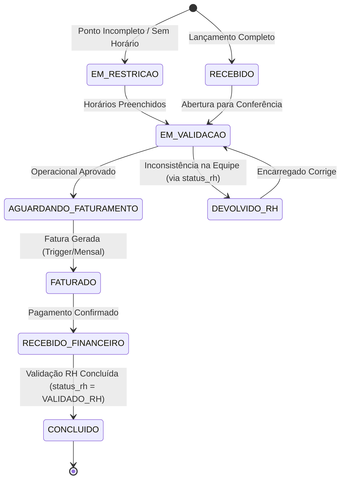
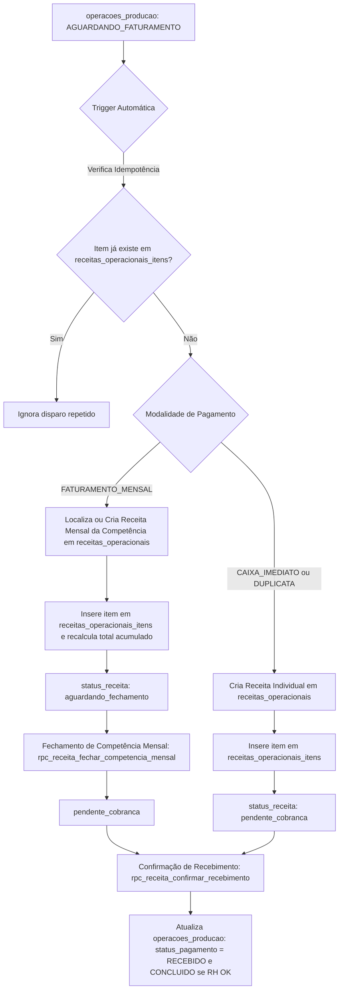

# UX05 — OPERAÇÕES DE CAMPO
# FASE 01 — AUDITORIA FUNCIONAL E ARQUITETURAL DE OPERAÇÕES POR VOLUME

**Documento:** `UX05_OPERACOES_VOLUME_FASE_01_AUDITORIA.md`  
**Status:** Auditado / Read-Only  
**Domínio:** ERP ORBE — Operações de Campo & Receitas Operacionais  
**Data da Auditoria:** Outubro de 2026  

---

## 1. OBJETIVO & FRONTEIRAS ARQUITETURAIS

A presente auditoria investiga de ponta a ponta o ciclo de vida, a persistência, as regras comerciais, a composição de equipe e o pipeline financeiro das **Operações por Volume** no ERP ORBE.

### Distinção Arquitetural Canônica

| Entidade / Módulo | Natureza | Responsabilidade Real | Usuário Alvo |
| :--- | :--- | :--- | :--- |
| **Operações por Volume** (UX05) | **Módulo Especialista de Execução** | Capturar a execução in loco do encarregado, validar apontamentos e horários, associar equipe, fixar snapshot comercial, registrar restrições e submeter à aprovação operacional/RH. | Encarregado de Campo, Supervisor Operacional, Analista RH |
| **Torre Operacional** (UX02) | **Torre de Controle & Gestão de Gargalos** | Monitorar em tempo real a saúde do fluxo: o que entrou, onde está travado, volumetria por etapa, SLAs estourados e pendências críticas sem listar CRUD analítico. | Gestores, Coordenadores, Direção de Operações |
| **R01 — Analítico de Operações por Volume** (UX04) | **Relatório Analítico & Auditoria Histórica** | Consultar grandes massas de dados consolidados, filtrar por competência, analisar tendências, investigar divergências históricas e exportar (CSV/PDF). | Controladoria, Auditoria, Faturamento, RH |
| **DRE Operacional** (UX03) | **Análise Econômica & Margem** | Confrontar a receita auferida por operação contra os custos diretos (mão de obra CLT/diaristas, insumos, ISS) pelo regime de competência da execução. | CFO, Diretoria Executiva, Controladoria |

> [!IMPORTANT]
> **Operações por Volume $\neq$ R01.** O módulo especialista é ativo e transacional (criar, validar, editar com OCC, investigar restrição de ponto, devolver ao campo). O relatório R01 é passivo e analítico (leitura, agrupamento, filtros multicritério e exportação).

---

## 2. MAPA DE ARQUIVOS, SERVIÇOS, COMPONENTES E SCHEMAS

### Frontend & Formulários
- [OperacaoForm.tsx](file:///y:/2026/ERP%20ESC%20LOG/Orbe/src/components/operacoes/OperacaoForm.tsx): Container de formulário com tabs (Dados da Operação, Equipe, Materiais, Resumo).
- [schema.ts](file:///y:/2026/ERP%20ESC%20LOG/Orbe/src/components/operacoes/schema.ts): Validação Zod com schema tipado (`operacaoFormSchema`), cálculos de ISS, validação de NF ("SIM"/"NÃO"/número), e coerência de horários.
- [useProductionForm.ts](file:///y:/2026/ERP%20ESC%20LOG/Orbe/src/hooks/useProductionForm.ts): Hook de orquestração do formulário, lookup de preços em `fornecedor_valores_servico`, auto-preenchimento e cálculo em tempo real.
- [FormStepTeam.tsx](file:///y:/2026/ERP%20ESC%20LOG/Orbe/src/components/operacoes/FormStepTeam.tsx): Gestão de equipe multipessoal (seleção de colaboradores, horários individuais de entrada/almoço/saída e infrações).
- [Operacoes.tsx](file:///y:/2026/ERP%20ESC%20LOG/Orbe/src/pages/Operacoes.tsx): Página principal administrativa de Operações por Volume.
- [OperacoesTableBlock.tsx](file:///y:/2026/ERP%20ESC%20LOG/Orbe/src/components/operacoes/OperacoesTableBlock.tsx): Grid operacional com expansão de linhas, badges de status operacional e status RH.
- [LancamentoProducao.tsx](file:///y:/2026/ERP%20ESC%20LOG/Orbe/src/pages/encarregado/LancamentoProducao.tsx): Ponto de entrada mobile/simplificado voltado ao Encarregado em campo.

### Serviços & Cálculos de Negócio
- [producao.service.ts](file:///y:/2026/ERP%20ESC%20LOG/Orbe/src/services/producao.service.ts): `OperacaoProducaoServiceClass` — CRUD completo, tratamento de OCC (`p_updated_at_frontend`), chamadas RPC (`rpc_operacao_validar_aprovar`, `rpc_operacao_excluir_segura`, `rpc_operacao_devolver_correcao`).
- [financeiro.ts](file:///y:/2026/ERP%20ESC%20LOG/Orbe/src/utils/financeiro.ts): `calcularValoresOperacao` — cálculo centralizado de `valor_descarga`, `custo_com_iss`, `valor_total_materiais` e `valor_total`.
- [fornecedorValorServico.service.ts](file:///y:/2026/ERP%20ESC%20LOG/Orbe/src/services/fornecedorValorServico.service.ts): Serviço de resolução da tabela de preços comerciais.

### Banco de Dados & Migrations
- `operacoes_producao`: Tabela mãe dos registros operacionais ([20260428173000_producao_in_loco_operacional.sql](file:///y:/2026/ERP%20ESC%20LOG/Orbe/supabase/migrations/20260428173000_producao_in_loco_operacional.sql), [20260701000000_split_operacoes_status_rh.sql](file:///y:/2026/ERP%20ESC%20LOG/Orbe/supabase/migrations/20260701000000_split_operacoes_status_rh.sql)).
- `production_entry_collaborators`: Tabela de vínculo de equipe por operação ([20260428233000_operacoes_producao_colaboradores_vinculados.sql](file:///y:/2026/ERP%20ESC%20LOG/Orbe/supabase/migrations/20260428233000_operacoes_producao_colaboradores_vinculados.sql)).
- `operacao_producao_materiais`: Materiais adicionais consumidos na operação (paletes, fitas, cantoneiras).
- `fn_gerar_receita_operacional_automatica`: Trigger AFTER UPDATE que integra automaticamente operações faturáveis com o pipeline financeiro de receitas ([20260917150000_fix_faturamento_mensal_complementar_multiorigem.sql](file:///y:/2026/ERP%20ESC%20LOG/Orbe/supabase/migrations/20260917150000_fix_faturamento_mensal_complementar_multiorigem.sql)).
- `rpc_receita_fechar_competencia_mensal`: RPC de fechamento financeiro mensal ([20260916230000_fix14_5_fechamento_competencia_mensal.sql](file:///y:/2026/ERP%20ESC%20LOG/Orbe/supabase/migrations/20260916230000_fix14_5_fechamento_competencia_mensal.sql)).
- `rpc_receita_confirmar_recebimento`: RPC de conciliação e baixa financeira com sincronização de status para a produção.

---

## 3. MATRIZ DO FORMULÁRIO DE LANÇAMENTO (OperacaoForm / LancamentoProducao)

Abaixo está a auditoria campo a campo baseada no código real executado no frontend (`schema.ts` e `OperacaoForm.tsx`) e sua persistência em `operacoes_producao`:

| Campo | Fonte | Obrigatório | Persistência | Regra de Negócio | Classificação | Perfil de Acesso |
| :--- | :--- | :--- | :--- | :--- | :--- | :--- |
| `empresa_id` | Select (empresas ativas) | **Sim** | `operacoes_producao.empresa_id` | Empresa tomadora / cliente da operação. Filtra regras de tabela comercial. | **MANUAL** | Encarregado / Admin |
| `unidade_id` | Select (unidades da empresa) | Não (opcional) | `operacoes_producao.unidade_id` | Filial / galpão onde ocorreu o serviço. | **MANUAL** | Encarregado / Admin |
| `data_operacao` | DatePicker | **Sim** | `operacoes_producao.data_operacao` | Data da execução in loco. Trava retroativa por governança. | **MANUAL** | Encarregado / Admin |
| `tipo_servico_id` | Select (tipos_servico_operacional) | **Sim** | `operacoes_producao.tipo_servico_id` | Tipo de operação (Descarga, Carregamento, Transbordo, Paletização). | **MANUAL** | Encarregado / Admin |
| `transportadora_id` | Select (transportadoras_clientes) | **Sim** | `operacoes_producao.transportadora_id` | Transportadora emitente do frete ou do manifesto. | **MANUAL** | Encarregado / Admin |
| `fornecedor_id` | Select (fornecedores) | **Sim** | `operacoes_producao.fornecedor_id` | Embarcador / fornecedor da mercadoria. Chave comercial. | **MANUAL** | Encarregado / Admin |
| `produto_carga_id` | Select (produtos_carga) | Não (opcional) | `operacoes_producao.produto_carga_id` | Produto transportado (ex: Refrigerante, Grãos). Chave comercial. | **MANUAL** | Encarregado / Admin |
| `forma_pagamento_id` | Select (formas_pagamento_operacional) | Não (opcional) | `operacoes_producao.forma_pagamento_id` | Define modalidade: `FATURAMENTO_MENSAL`, `CAIXA_IMEDIATO`, `DUPLICATA`. | **MANUAL / AUTO** | Encarregado / Admin |
| `quantidade` | Input numérico | **Sim** | `operacoes_producao.quantidade` | Volume bruto movimentado (caixas, pallets, toneladas, etc.). | **MANUAL** | Encarregado / Admin |
| `valor_unitario` | Lookup Comercial (`resolver_valor_operacao`) | **Sim** | `operacoes_producao.valor_unitario_snapshot` | Preço acordado na tabela comercial. Se não cadastrado, permite digitação (se perfil tiver permissão). | **SNAPSHOT** | Sistema / Admin |
| `tipo_calculo` | Cadastro Comercial | **Sim** | `operacoes_producao.tipo_calculo_snapshot` | Define fórmula: `'volume'`, `'fixo'`, `'colaborador'`. Default: `'volume'`. | **SNAPSHOT** | Sistema |
| `valor_descarga` | Cálculo aritmético | **Sim** | `operacoes_producao.valor_descarga` | `quantidade * valor_unitario_snapshot` (ou valor fixo). | **DERIVADO** | Sistema |
| `nf_numero` | Input de texto | Não (opcional) | `operacoes_producao.nf_numero` | Indicador ou número da NF ("SIM", "NÃO", ou número da nota fiscal). | **MANUAL** | Encarregado / Admin |
| `percentual_iss` | Regra Fiscal (`useProductionForm`) | **Sim** | `operacoes_producao.percentual_iss` | Se NF emitida ("SIM" ou número), aplica alíquota (ex: 5% ou 0.05). Se "NÃO", 0%. | **DERIVADO** | Sistema |
| `custo_com_iss` | Cálculo aritmético | **Sim** | `operacoes_producao.custo_com_iss` | `valor_descarga * percentual_iss`. Imposto retido/previsto. | **DERIVADO** | Sistema |
| `materiais` | Sub-tabela de itens | Não (opcional) | `operacao_producao_materiais` + `valor_total_materiais` | Consumo de insumos adicionais (filme stretch, cantoneiras, paletes). | **MANUAL** | Encarregado / Admin |
| `valor_total` | Cálculo aritmético | **Sim** | `operacoes_producao.valor_total` | `valor_descarga + custo_com_iss + valor_total_materiais`. | **DERIVADO** | Sistema |
| `placa` | Input texto (com regex Mercosul) | Não (opcional) | `operacoes_producao.placa` | Placa do veículo/carreta descarregado. Formato Mercosul ou antigo. | **MANUAL** | Encarregado / Admin |
| `ctrc` | Input de texto | Não (opcional) | `operacoes_producao.ctrc` | Número do Conhecimento de Transporte Eletrônico. | **MANUAL** | Encarregado / Admin |
| `entrada_ponto` | TimePicker | **Sim** (para não restringir) | `operacoes_producao.entrada_ponto` | Horário de início efetivo da operação. | **MANUAL** | Encarregado |
| `saida_ponto` | TimePicker | **Sim** (para não restringir) | `operacoes_producao.saida_ponto` | Horário de término da operação. Se ausente, vai para `EM_RESTRICAO`. | **MANUAL** | Encarregado |
| `colaboradores` | Multi-select com horários individuais | **Sim** | `production_entry_collaborators` + `quantidade_colaboradores` | Lista de membros da equipe in loco, horários e infrações. | **MANUAL** | Encarregado |
| `observacoes` | Textarea | Não (opcional) | `operacoes_producao.observacoes` | Observações operacionais de campo. | **MANUAL** | Encarregado |
| `status` | Máquina de estados do backend | **Sim** | `operacoes_producao.status` | Status operacional (`RECEBIDO`, `EM_VALIDACAO`, `EM_RESTRICAO`, etc.). | **AUTOMÁTICO** | Sistema / RH / Fin |
| `status_rh` | Máquina de estados RH | **Sim** | `operacoes_producao.status_rh` | Status da validação de pessoal (`PENDENTE_RH`, `VALIDADO_RH`, etc.). | **AUTOMÁTICO** | RH |

---

## 4. AUDITORIA DA ENTIDADE `operacoes_producao`

Estrutura auditada via migrations oficiais do banco de dados:

### Chaves e Índices Primários
- **PK:** `id` (UUID DEFAULT `uuid_generate_v4()`).
- **Tenant Isolation:** `tenant_id` (UUID NOT NULL, REFERENCES `public.tenants(id)`). Protegido via RLS com `tenant_id = public.current_tenant_id()`.
- **Foreign Keys Operacionais:**
  - `empresa_id` (UUID NOT NULL, FK `public.empresas(id)`).
  - `unidade_id` (UUID NULL, FK `public.unidades(id)`).
  - `tipo_servico_id` (UUID NOT NULL, FK `public.tipos_servico_operacional(id)`).
  - `transportadora_id` (UUID NOT NULL, FK `public.transportadoras_clientes(id)`).
  - `fornecedor_id` (UUID NOT NULL, FK `public.fornecedores(id)`).
  - `produto_carga_id` (UUID NULL, FK `public.produtos_carga(id)`).
  - `forma_pagamento_id` (UUID NULL, FK `public.formas_pagamento_operacional(id)`).
  - `colaborador_id` (UUID NULL, FK `public.colaboradores(id)` — campo de compatibilidade legada; a equipe real é mantida em `production_entry_collaborators`).
- **Valores Monetários & Snapshots:**
  - `quantidade` (NUMERIC(15,2) NOT NULL, CHECK `quantidade > 0`).
  - `valor_unitario_snapshot` (NUMERIC(15,4) NOT NULL, CHECK `valor_unitario_snapshot >= 0`).
  - `tipo_calculo_snapshot` (TEXT NOT NULL DEFAULT 'volume', CHECK `tipo_calculo_snapshot IN ('volume', 'fixo', 'colaborador')`).
  - `valor_descarga` (NUMERIC(15,2) NOT NULL DEFAULT 0.00).
  - `percentual_iss` (NUMERIC(5,4) NOT NULL DEFAULT 0.00).
  - `custo_com_iss` (NUMERIC(15,2) NOT NULL DEFAULT 0.00).
  - `valor_total_materiais` (NUMERIC(15,2) NOT NULL DEFAULT 0.00).
  - `valor_total` (NUMERIC(15,2) NOT NULL DEFAULT 0.00).
- **Campos de Controle e Governança:**
  - `status` (TEXT NOT NULL DEFAULT 'RECEBIDO', CHECK `status IN ('RECEBIDO', 'EM_VALIDACAO', 'EM_RESTRICAO', 'AGUARDANDO_FATURAMENTO', 'FATURADO', 'RECEBIDO_FINANCEIRO', 'CONCLUIDO')`).
  - `status_rh` (TEXT NOT NULL DEFAULT 'PENDENTE_RH', CHECK `status_rh IN ('PENDENTE_RH', 'EM_ANALISE_RH', 'VALIDADO_RH', 'DEVOLVIDO_RH')`).
  - `avaliacao_json` (JSONB NULL) — armazena inconsistências detectadas (ex: `{"motivo_restricao": "Horário de início e/ou término não informado"}`).
  - `justificativa_retroativa` (TEXT NULL) — preenchimento obrigatório quando a data de lançamento é retroativa.
  - `criado_em` (TIMESTAMPTZ NOT NULL DEFAULT `now()`), `atualizado_em` (TIMESTAMPTZ NOT NULL DEFAULT `now()`).
  - `deleted_at` (TIMESTAMPTZ NULL), `deleted_by` (UUID NULL), `motivo_exclusao` (TEXT NULL) — soft-delete auditável.

---

## 5. MOTOR DE PREÇO E CÁLCULO COMERCIAL

### 5.1 Lookup Comercial
1. O frontend ou a RPC invoca a função `resolver_valor_operacao` passando a tupla:
   $$(empresa\_id, fornecedor\_id, tipo\_servico\_id, unidade\_id, transportadora\_id, produto\_carga\_id, data\_operacao)$$
2. O banco busca na tabela `fornecedor_valores_servico` a regra com a maior especificidade de filtros ativa para a data informada.
3. Se encontrada, obtém `valor_unitario` e `tipo_calculo`.
4. Se não encontrada, o formulário sinaliza que o serviço não possui tabela e exige intervenção manual com permissão administrativa (`allow_manual_price`).

### 5.2 Snapshot e Imutabilidade
No momento da submissão do formulário, os valores são fixados nas colunas:
- `valor_unitario_snapshot`
- `tipo_calculo_snapshot`
- `valor_descarga`
- `custo_com_iss`
- `valor_total`

> [!NOTE]
> Essa estratégia garante que, caso a tabela `fornecedor_valores_servico` seja reajustada no futuro para novas negociações, o histórico e a fatura da operação já executada **não sofram alteração retroativa**.

### 5.3 Fórmula Aritmética
$$\text{valor\_descarga} = \begin{cases} \text{quantidade} \times \text{valor\_unitario\_snapshot} & \text{se } tipo = \text{'volume'} \\ \text{valor\_unitario\_snapshot} & \text{se } tipo = \text{'fixo'} \\ \text{quantidade\_colaboradores} \times \text{valor\_unitario\_snapshot} & \text{se } tipo = \text{'colaborador'} \end{cases}$$

$$\text{custo\_com\_iss} = \text{valor\_descarga} \times \text{percentual\_iss}$$

$$\text{valor\_total} = \text{valor\_descarga} + \text{custo\_com\_iss} + \text{valor\_total\_materiais}$$

---

## 6. GESTÃO DA EQUIPE (`production_entry_collaborators`)

### 6.1 Estrutura da Tabela
A tabela `production_entry_collaborators` mantém a relação N:N entre cada operação e os trabalhadores de campo:
- `id` (UUID PK)
- `production_entry_id` (UUID FK `operacoes_producao.id` ON DELETE CASCADE)
- `collaborator_id` (UUID FK `colaboradores.id`)
- `entrada_ponto` (TIME NULL)
- `saida_almoco` (TIME NULL)
- `retorno_almoco` (TIME NULL)
- `saida_ponto` (TIME NULL)
- `had_infraction` (BOOLEAN DEFAULT FALSE)
- `infraction_type_id` (UUID NULL)
- `infraction_notes` (TEXT NULL)
- **Constraint Única:** `UNIQUE(production_entry_id, collaborator_id)` — impede que o mesmo colaborador seja inserido duas vezes na mesma operação.

### 6.2 Vínculo com o Ponto e Ausência de Rateio Financeiro Individual
- **Vínculo Físico / RH:** Os horários informados em `production_entry_collaborators` servem para o RH validar a jornada in loco confrontando com o coletor eletrônico de ponto (CLT) ou com a grade semanal de Diaristas.
- **Não há Rateio Financeiro de Mão de Obra na Operação:** A receita da operação pertence integralmente à empresa tomadora/contratante. O colaborador recebe seu salário contratual (CLT) ou sua diária fixa (Diarista), independentemente do valor faturado na carga. O DRE Operacional confronta o custo da folha e das diárias alocadas contra a receita bruta auferida.

---

## 7. MÁQUINA DE ESTADOS E TRANSIÇÕES

O sistema adota um modelo de **Pipeline Duplo Desacoplado**:
1. `status` (Ciclo de Vida Operacional & Financeiro)
2. `status_rh` (Ciclo de Validação de Pessoal & Ponto)



### Matriz de Transições de Estado

| Estado Origem | Estado Destino | Agente Responsável | Condição de Disparo | Efeito Sistêmico |
| :--- | :--- | :--- | :--- | :--- |
| *(Novo)* | `RECEBIDO` | Encarregado | Inserção com horários de início e término válidos e equipe informada. | Registro salvo, `status_rh = 'PENDENTE_RH'`. Fica visível na fila de conferência. |
| *(Novo)* | `EM_RESTRICAO` | Sistema (Trigger/Service) | Inserção com `entrada_ponto` ou `saida_ponto` nulos. | Grava em `avaliacao_json.motivo_restricao`. Bloqueia avanço para faturamento até saneamento. |
| `EM_RESTRICAO` | `EM_VALIDACAO` | Encarregado / Supervisor | Edição preenchendo os horários ausentes. | Limpa o motivo de restrição e move para conferência. |
| `RECEBIDO` / `EM_VALIDACAO` | `AGUARDANDO_FATURAMENTO` | Supervisor Operacional / RH | Execução da RPC `rpc_operacao_validar_aprovar`. | Dispara a trigger `fn_gerar_receita_operacional_automatica`. |
| `EM_VALIDACAO` | `DEVOLVIDO_RH` | Analista de RH | Execução da RPC `rpc_operacao_devolver_correcao` via `status_rh`. | Define `status_rh = 'DEVOLVIDO_RH'`, exibe alerta para o encarregado e impede faturamento. |
| `AGUARDANDO_FATURAMENTO` | `FATURADO` | Sistema Financeiro | Criação da fatura avulsa ou vinculação em lote de faturamento mensal. | Vincula registro em `receitas_operacionais_itens`. Operação torna-se **imutável**. |
| `FATURADO` | `RECEBIDO_FINANCEIRO` | Analista Financeiro | Baixa ou conciliação em `receitas_operacionais`. | Atualiza `status_pagamento = 'RECEBIDO'`, define `data_pagamento`. |
| `RECEBIDO_FINANCEIRO` | `CONCLUIDO` | Trigger / RPC de Recebimento | `status_rh == 'VALIDADO_RH'` E receita liquidada. | Ciclo integralmente finalizado (operacional, RH e financeiro arquivados). |

---

## 8. PIPELINE DE FATURAMENTO E RECEITAS

A integração entre a Operação e o Financeiro é regida pela migration `20260917150000_fix_faturamento_mensal_complementar_multiorigem.sql` e executada pela trigger `fn_gerar_receita_operacional_automatica`:



### Respostas aos Critérios do Briefing:
1. **Uma operação gera uma receita?** Para `CAIXA_IMEDIATO` e `DUPLICATA`, sim: 1 operação gera 1 registro individual em `receitas_operacionais` com 1 registro filho em `receitas_operacionais_itens`.
2. **Várias operações podem formar uma receita?** Sim. Para `FATURAMENTO_MENSAL`, todas as operações aprovadas da mesma empresa, cliente e competência são agregadas na mesma fatura mensal pai em `receitas_operacionais`.
3. **Existe fechamento/lote?** Sim. No faturamento mensal, as receitas permanecem em `aguardando_fechamento`. O fechamento oficial ocorre via `rpc_receita_fechar_competencia_mensal`, que consolida o lote e altera o status para `pendente_cobranca`.
4. **Quando a receita nasce?** No exato momento em que `operacoes_producao.status` atinge `AGUARDANDO_FATURAMENTO` (ou `FATURADO`), acionado pela trigger do banco.
5. **Quem dispara?** A trigger `fn_gerar_receita_operacional_automatica` no Supabase (execução transacional no Postgres).
6. **Existe idempotência?** Sim. A trigger executa:
   ```sql
   SELECT EXISTS(SELECT 1 FROM receitas_operacionais_itens WHERE operacao_id = NEW.id);
   ```
   Se já existir vínculo, o processo é abortado sem duplicar registros financeiros.

---

## 9. COMPETÊNCIA E TEMPORALIDADE (DRE-FIX01)

Na auditoria das regras de temporalidade:
- `data_operacao`: É a data física da descarga/carregamento. **É ela que define a competência econômica (mês/ano) para apuração no DRE**, em conformidade com os princípios contábeis de competência homologados no Hotfix DRE-FIX01.
- `created_at`: Carimbo de data/hora do momento do lançamento no banco.
- `competencia`: Formatada como `YYYY-MM` (ex: `2026-10`), extraída diretamente de `TO_CHAR(data_operacao, 'YYYY-MM')`.
- `data_faturamento` / `data_vencimento`: Datas financeiras que regulam o fluxo de caixa (regime de caixa) em `receitas_operacionais`.

---

## 10. EDIÇÃO, CONCORRÊNCIA (OCC), CANCELAMENTO E AUDITORIA

### 10.1 Controle de Concorrência Otimista (OCC)
Em `producao.service.ts`, o método `atualizar` implementa trava por `updated_at`:
```typescript
if (payload.updated_at_frontend) {
  query = query.eq('atualizado_em', payload.updated_at_frontend);
}
```
Se outro usuário ou processo tiver alterado o registro enquanto o formulário estava aberto, a atualização falha com zero linhas afetadas, retornando erro `CONCORRENCIA_DETECTADA` e impedindo a sobrescrita silenciosa de dados.

### 10.2 Proteção Contra Edição Pós-Faturamento
O sistema proíbe categoricamente edições destrutivas após o ingresso no pipeline financeiro. Caso a operação esteja em:
`'AGUARDANDO_FATURAMENTO'`, `'FATURADO'`, `'RECEBIDO_FINANCEIRO'`, ou `'CONCLUIDO'`, qualquer tentativa de alteração de volume, cliente ou valor pelo formulário operacional é bloqueada pelo banco/service com erro de `ESTADO_FECHADO`.

### 10.3 Exclusão e Cancelamento
- Não existe `DELETE` físico exposto ao usuário.
- O cancelamento utiliza a RPC `rpc_operacao_excluir_segura`, que valida:
  1. Se a operação já está em `FATURADO` ou vinculada a uma cobrança paga, a exclusão é sumariamente rejeitada.
  2. Se autorizada, aplica **Soft Delete** gravando `deleted_at = now()`, `deleted_by = auth.uid()` e o texto obrigatório `motivo_exclusao`.
- As consultas comuns filtram automaticamente `WHERE deleted_at IS NULL`.

---

## 11. PERFIS DE ACESSO E ISOLAMENTO MULTITENANT (RLS)

- **Encarregado:** Possui visão restrita ao portal operacional (`/encarregado/producao`). Lança dados in loco de sua unidade/empresa de alocação. Não possui permissão de leitura sobre tabelas de contas a pagar, DRE, CNAB ou faturamento.
- **Supervisor Operacional / Admin:** Acessa `/operacoes`. Possui controle sobre a aprovação, revisão de apontamentos, edição corretiva e encaminhamento para faturamento.
- **Analista RH:** Valida a consistência da equipe e horas trabalhadas (`status_rh`). Pode devolver lançamentos com incoerência de ponto (`rpc_operacao_devolver_correcao`).
- **Analista Financeiro:** Recebe as operações aprovadas, consolida faturamentos mensais, emite boletos e realiza a baixa de liquidação.
- **Isolamento Multitenant:**
  Todas as consultas a `operacoes_producao`, `production_entry_collaborators` e `receitas_operacionais` possuem cláusula RLS mandatória:
  ```sql
  WHERE tenant_id = public.current_tenant_id()
  ```
  Impedindo vazamento cruzado de dados entre diferentes operações contratadas.

---

## 12. MATRIZ DE RISCOS (P0 A P3)

| Criticidade | Risco Identificado | Evidência no Código Atual | Impacto | Mitigação Arquitetural |
| :---: | :--- | :--- | :--- | :--- |
| **P0** | Edição manual de preço por usuário sem regra comercial | `schema.ts`: `allow_manual_price` permite informar valor livre se tabela não existir. | Distorção de faturamento e margem negativa não autorizada. | Exigir autorização explícita de supervisão ou travar gravação se não houver tabela homologada. |
| **P1** | Operação sem horário entrar em `EM_RESTRICAO` mas avançar por aprovação forçada | Validação visual na tabela que pode permitir clique em Aprovar antes de sanar horários. | Faturamento de apontamento com horas incorretas, gerando passivo trabalhista CLT. | A RPC `rpc_operacao_validar_aprovar` rejeita status `EM_RESTRICAO` no banco de dados. |
| **P2** | Divergência entre `quantidade_colaboradores` e itens de `production_entry_collaborators` | `quantidade_colaboradores` é um inteiro livre no cabeçalho, enquanto a equipe é cadastrada em tabela filha. | Contradizer o headcount no DRE e na folha de ponto. | O frontend deve forçar `quantidade_colaboradores = selectedCollaborators.length`. |
| **P3** | Preenchimento de NF como string livre ("SIM"/"NÃO"/Número) | `schema.ts` e `OperacaoForm.tsx` tratam o campo `nf_numero` como texto aberto. | Dificuldade de cruzamento com notas fiscais eletrônicas da prefeitura/SEFAZ. | Tipar formalmente na UX com switch boolean (`possui_nf`) + campo opcional de chave/número. |

---

## 13. CONCLUSÕES FINAIS & DIRETRIZES PARA O UX LAB (UX05)

### O QUE DEVE PERMANECER
1. **O Snapshot Comercial Imutável:** Manter intacto o mecanismo que congela `valor_unitario_snapshot`, `valor_descarga` e `custo_com_iss` no instante da criação/aprovação.
2. **A Gestão Multipessoal de Equipe:** Preservar a tabela `production_entry_collaborators` e o registro individual de horários e infrações.
3. **O Desacoplamento de Status:** Manter a separação estrita entre `status` (operacional/financeiro) e `status_rh` (conferência de jornada e RH).
4. **A Trava de OCC:** Preservar a verificação de concorrência por timestamp no backend.
5. **A Idempotência na Trigger de Faturamento:** Manter o disparo automático para `receitas_operacionais` apenas no status `AGUARDANDO_FATURAMENTO`.

### O QUE DEVE SAIR
1. **Mapeamento Indevido de Operações para R01:** A Sidebar e qualquer menu operacional **não devem** redirecionar o usuário para o Relatório R01 como substituto de tela de trabalho.
2. **Edição Livre de Headcount:** O campo `quantidade_colaboradores` não deve ser digitado manualmente pelo usuário; deve ser calculado pelo número de membros da equipe vinculados.
3. **Ambiguidade no Campo NF:** Eliminar o campo de texto livre que aceita misturar "SIM", "NÃO" e números de notas fiscais no mesmo input.

### O QUE DEVE SER CONTEXTUAL
1. **Alerta de Restrição de Ponto:** Se `entrada_ponto` ou `saida_ponto` estiverem nulos, exibir banner contextual no formulário explicando que o registro nascerá com status `EM_RESTRICAO`.
2. **Justificativa de Lançamento Retroativo:** O campo de justificativa só deve ser exibido se `data_operacao` for anterior à data permitida pelo parâmetro de governança do tenant.
3. **Painel de Materiais:** O bloco de paletes/filme só deve ser expandido se o serviço ou cliente exigir controle de insumos.

### O QUE DEVE SER AUTOMÁTICO
1. **Lookup Comercial:** Resolução de preço unitário e alíquota de ISS por inferência imediata da combinação de empresa, fornecedor, serviço e data.
2. **Cálculo de Totais:** Recálculo em tempo real de `valor_descarga`, `custo_com_iss` e `valor_total`.
3. **Integração com Receitas:** Envio automático para faturamento mensal ou cobrança avulsa sem necessidade de lançamento financeiro duplicado.
4. **Sincronização de Baixa:** Transição automática para `CONCLUIDO` quando o financeiro concilia o recebimento e o RH conclui a validação de equipe.

### O QUE PRECISA DE FIX FUNCIONAL ANTES DA UX
1. **Homogeneização do Campo NF no Banco:** O campo `nf_numero` deve ser padronizado para evitar que "SIM" e "NÃO" quebrem buscas exatas por faturas.
2. **Sincronização Rígida de Headcount:** Validação a nível de banco (check constraint ou trigger) garantindo que `quantidade_colaboradores` coincida com a contagem de registros em `production_entry_collaborators`.
3. **RPC de Validação com Bloqueio Explícito de Inconsistência:** Garantir que nenhuma operação em `EM_RESTRICAO` seja aprovada inadvertidamente pelo painel web.

---
*Fim da Auditoria da Fase 01 da UX05. O sistema encontra-se integralmente auditado, mapeado e pronto para a Fase 02 de concepção e prototipação.*
